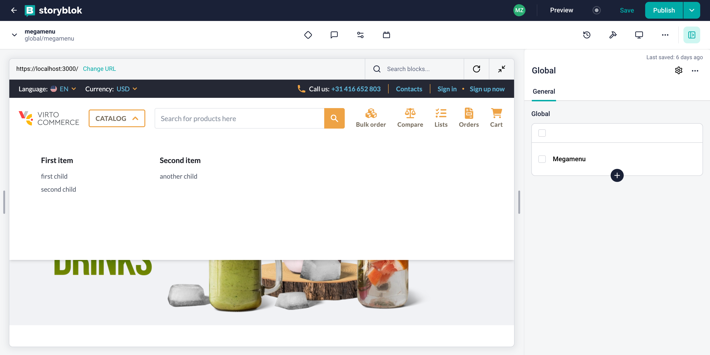

# Overview

In this article, we will integrate **Catalog Menu** with the Storyblok CMS. The integration will allow you to create and manage catalog navigation links in the Storyblok CMS and display them in the `Virto Commerce vue-b2b-theme`.

With this guide, we will:

1. [Set up and create global componenet.](catalog-menu-integration.md#set-up-global-component)
1. [Create catalog menu block.](catalog-menu-integration.md#create-catalog-menu-block)
1. [Create catalog menu content.](catalog-menu-integration.md#create-catalog-menu-content)
1. [Fetch content from Storyblok.](catalog-menu-integration.md#fetch-content-from-storyblok-and-display-in-vue-b2b-theme)

## Set Up Global Component

To set up a folder in Storyblok:

1. Define a content type for the folder. Let's name it **global** as it will hold our global components. We should also ensure that the content type in the global folder cannot be changed, so that we only have entries of that type. Additionally, we should select the default content type option so that **global** is already chosen.

    

    If you don't have a **global** content type, create it by clicking on the **New content type** button.

    

1. Create our first entry within the folder. When creating the entry, ensure that the content type is set to **global** as we have disabled the ability to change the content type for the folder. You can choose any name for the entry, but make sure it accurately describes the content of the global component to your editors. Since we are creating a **Catalog Menu**, which is in fact a **megamenu**, we will name the entry **Megamenu**.

    

1. Set up the actual field in the entry that holds our component. We will click **Define** and add a new field called **global** of the **Blocks** type.

    

## Create Catalog Menu Block

To create a new block called **megamenu**:

1. Go to the **Block Library** menu and click **New Block** in the top right corner. 
1. Enter the name of the component. We will enter **Megamenu**. 
1. Add a new field called **items** of type **Blocks**.
1. Click **Save**.

    

1. Since components in Storyblok have a block structure, we need to create blocks for each menu item and each menu link in the same way. For this, we will create the **Megamenu-item** block and the **Megamenu-link-item** block of the **Nestable block** type. The **Megamenu-item** block structure can be as follows:

    

    The **Megamenu-link-item** block structure can be as follows:

    

1. Link all the blocks together to restrict the selection of external blocks that are not related to the **megamenu**:
    1. Go to the settings of each block to find the entry with the type **Blocks** in the **General section** and in the **Edit field** section.
    1. Check **Allow only specific components to be inserted**.
    1. Choose the component that can be nested in this block. In our example, the nesting looks as follows:

        ```text
        Megamenu
            └── Megamenu-item
                    └── Megamenu-link-item
        ```


        **Megamenu** block configuration can be as follows:

        

The blocks have been created and their nesting has been configured.

## Create Catalog Menu Content

To create the content for our **Catalog Menu**:

1. Go to the **Content** menu and click on the **Megamenu** entry we created earlier. 
1. Click on the **Add Block** button and select the **Megamenu** block.

    

1. Add the **Megamenu-item** block.
1. Add the **Megamenu-link-item** block. 
1. Fill in the necessary fields for each block.
1. Click **Save** to save the changes.

## Fetch Content from Storyblok and Display in vue-b2b-theme

To fetch content from Storyblok and display it in the **vue-b2b-theme**:

1. Go to the **vue-b2b-theme** and edit the `useNavigations` composable. Change the `fetchCatalogMenu` method to fetch the **Catalog Menu** from Storyblok. 
1. Replace the `getMenu` method call with the `useStoryblok` method call.
1. Pass the path to our menu.

    ```typescript title="client-app/core/composables/useNavigations.ts" linenums="1"
    export function useNavigations() {
        // ...
        async function fetchCatalogMenu() {
        // ...

        try {
        if (catalog_menu_link_list_name) {

            // Commented out the old method of fetching the catalog menu
            // catalogMenuItems.value = (await getMenu(catalog_menu_link_list_name)).map((item) =>
            //   convertToExtendedMenuLink(item, true),
            // );

            // Get catalog menu from Storyblok
            catalogMenuItems.value = (
            await useStoryblok("global/megamenu", { version: "draft" })
            ).value.content.global.find((x: any) => x.component === "Megamenu")?.items;

        } else {
            // ...
        }
        }
        // ...
    }
    // ...
    }
    ```

The **Catalog Menu** is now fetched from Storyblok and displayed in the **vue-b2b-theme**:



You can publish the changes and see the **Catalog Menu** in the **vue-b2b-theme**.
