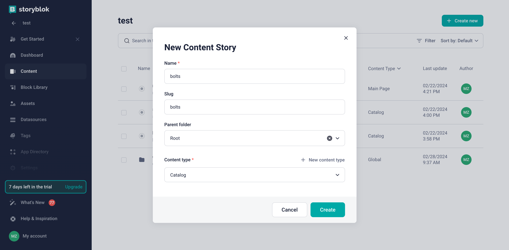
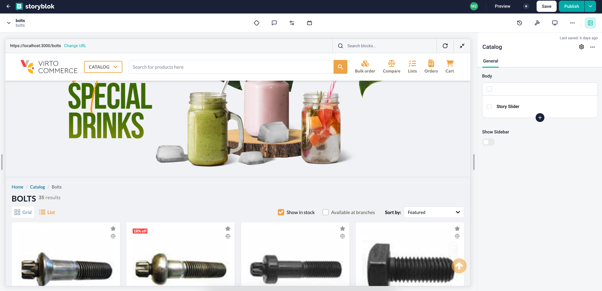

# Overview

In this article, we will integrate `Storyblok CMS` into the category page of the `Virto Commerce vue-b2b-theme`. The integration will allow you to create and manage content in `Storyblok CMS` and display it in the `Virto Commerce vue-b2b-theme`.

To use `Storyblok CMS` with the page you need to follow these steps:

1. **Create page model**: First, you need to create a page model in the `Storyblok CMS` for the category page. The page model should define the properties of the category page and how it should be rendered in the `Storyblok CMS`.
2. **Add Storyblok to the page component**: After creating a page model, you need to add `Storyblok` to the page component in the `Virto Commerce vue-b2b-theme`. This will allow you to fetch content from `Storyblok` and display it in the category page.
3. **Create content**: After creating a page model, you can start creating content in the `Storyblok CMS`. You can create content by adding components to your page model and filling them with content.

## Create Page Model in Storyblok

First, navigate to the `Block Library` menu and click on `New Block` in the top right corner. You will be prompted with an input field to name the component. We will use `Catalog` as the name. After confirming the name, add a new field called `body` of type `Blocks` and `showSidebar` of type `Boolean`. This will allow you to hide the sidebar if needed. Finally, click on `Save`.


Now we can use this block to create the content for our category page, so we can proceed to create the page content. We will navigate to the `Content` menu and click on the `Create new` to create new `Story` with previously created `Catalog` block:



## Add Storyblok to the Page Component

To integrate 'Storyblok' with the category page, you need to follow these steps:

1) Create new 'landing-page.vue' component in the 'client-app/shared' folder.

=== "Template"

    ```html title="client-app/shared/landing-page.vue"
    <template>
        <div v-if="story">
            <StoryblokComponent v-for="blok in story?.content?.body" :key="blok._uid" :blok="blok" />
            <slot v-bind="story?.content"></slot>
        </div>
    </template>
    ```

=== "Script"

    ```typescript title="client-app/shared/landing-page.vue"
    import { useStoryblok } from "@storyblok/vue";
    import { useRouter } from "vue-router";

    const router = useRouter();

    let story = await tryLoadContent(window.location.pathname);

    router.beforeEach(async (to) => {
        story = await tryLoadContent(to.fullPath);
    });

    async function tryLoadContent(urlPath: string) {
        return await useStoryblok(urlPath, { version: "draft" });
    }
    ```

2) Add the `landing-page.vue` component to the `matcher.vue` component as a wrapper and pass slot props `storyblokProps` to `Category` component.

```html title="client-app/pages/matcher.vue"
<template>
  <LandingPage>
    <template #default="storyblokProps">
      <component
        :is="Category"
        v-if="seoInfo?.entity?.objectType === 'Category'"
        :category-id="seoInfo?.entity?.objectId"
        v-bind="storyblokProps"
      />
      <component
        :is="Product"
        v-else-if="seoInfo?.entity?.objectType === 'CatalogProduct'"
        :product-id="seoInfo?.entity?.objectId"
      />

      <component :is="StaticPage" v-else-if="seoInfo?.page" />

      <NotFound v-else-if="!loading" />
    </template>
  </LandingPage>
</template>
```

3) As we want to use `showSidebar` property to control sidebar visibility - we should change the `category.vue` component to use props from `matcher.vue` and add `v-if` condition on `sidebar` section.

```html title="client-app/shared/catalog/components/category.vue" linenums="1"
<template>
     <!-- Sidebar -->
      <div class="flex items-stretch lg:gap-6">
        <template v-if="showSidebar">

          <!-- Sidebar template -->

        </template>
      </div>
</template>
```

```typescript title="client-app/shared/catalog/components/category.vue" linenums="1"
interface IProps {
  categoryId?: string;
  isSearchPage?: boolean;
  showSidebar?: boolean;
}

const props = withDefaults(defineProps<IProps>(), {
  showSidebar: true,
});
```

Now you can preview the category page in the `Storyblok` and start creating content for it.

## Create content

After adding `Storyblok` to the category page component, you can start creating content in the `Storyblok CMS`. You can create content by adding components to your page model and filling them with content.

If you have already added custom components to `Storyblok`, you can use them to create content for the page. For more details on how to add custom components to Storyblok, you can read the article [Registering Custom Components](./registering-custom-components.md).

As a result, you will get integration of `Storyblok CMS` with the category page of `Virto Commerce vue-b2b-theme`:


