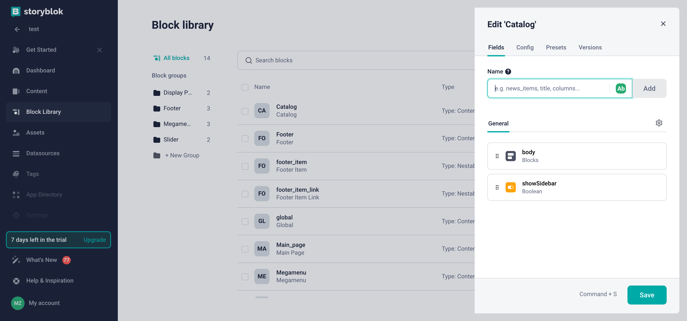
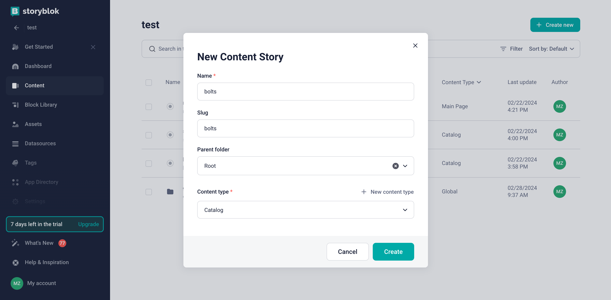
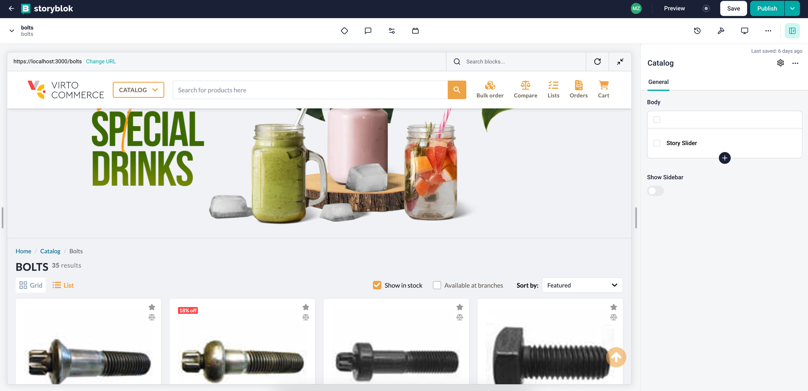

# Overview

In this article, we will integrate Storyblok CMS into the category page of the **Virto Commerce vue-b2b-theme**. The integration will allow you to create and manage content in Storyblok CMS and display it in the **Virto Commerce vue-b2b-theme**.

To use Storyblok CMS with the page:

1. [Create page model in the Storyblok CMS for the category page](category-page-integration.md#create-page-model-in-storyblok). The page model defines the properties of the category page and how it is rendered in the Storyblok CMS.
1. [Add Storyblok to the page component in **Virto Commerce vue-b2b-theme**](category-page-integration.md#add-storyblok-to-page-component). This allows you to fetch content from Storyblok and display it in the category page.
1. [Create content in the Storyblok CMS](category-page-integration.md#create-content). Add components to your page model and fill them with content.

## Create Page Model in Storyblok

To create Page Model in Storyblok:

1. Go to the **Block Library** menu and click **New Block** in the top right corner. 
1. Enter the name of the component. We enter **Catalog** as the name. 
1. Add a new field called **body** of type **Blocks** and **showSidebar** of type **Boolean**. This will allow you to hide the sidebar if needed. 
1. Click **Save** to save the changes.

    

1. Use this block to create the content for our category page: Go to the **Content** menu and click on the **Create new** to create new **Story** with previously created **Catalog** block:

    

## Add Storyblok to Page Component

To integrate Storyblok with the category page:

1. Create new **landing-page.vue** component in the **client-app/shared** folder:

    === "Template"

        ```html title="client-app/shared/landing-page.vue"
        <template>
            <div>
                <template v-if="story">
                    <StoryblokComponent v-for="blok in story?.content?.body" :key="blok._uid" :blok="blok" />
                </template>
                <slot v-bind="story?.content" key="catalog"></slot>
            </div>
        </template>
        ```

    === "Script"

        ```typescript title="client-app/shared/landing-page.vue"
        import { useStoryblok } from "@storyblok/vue";
        import { onBeforeMount, ref, toValue } from "vue";
        import { onBeforeRouteUpdate } from "vue-router";

        const story = ref({});

        onBeforeMount(async () => {
            await tryLoadContent(window.location.pathname);
        });

        onBeforeRouteUpdate(async (to) => {
            await tryLoadContent(to.fullPath);
        });

        async function tryLoadContent(urlPath: string) {
            story.value = toValue(await useStoryblok(urlPath, { version: "draft" }));
        }
        ```

1. Add the **landing-page.vue** component to the **matcher.vue** component as a wrapper and pass slot props `storyblokProps` to `Category` component:

    ```html title="client-app/pages/matcher.vue"
    <template>
    <LandingPage>
        <template #default="storyblokProps">
        <component
            :is="Category"
            v-if="seoInfo?.entity?.objectType === 'Category'"
            :category-id="seoInfo?.entity?.objectId"
            v-bind="storyblokProps"
        />
        <component
            :is="Product"
            v-else-if="seoInfo?.entity?.objectType === 'CatalogProduct'"
            :product-id="seoInfo?.entity?.objectId"
        />

        <component :is="StaticPage" v-else-if="seoInfo?.page" />

        <NotFound v-else-if="!loading" />
        </template>
    </LandingPage>
    </template>
    ```

1. As we want to use `showSidebar` property to control sidebar visibility, we change the `category.vue` component to use props from `matcher.vue` and add `v-if` condition on `sidebar` section.

    ```html title="client-app/shared/catalog/components/category.vue" linenums="1"
    <template>
        <!-- Sidebar -->
        <div class="flex items-stretch lg:gap-6">
            <template v-if="showSidebar">

            <!-- Sidebar template -->

            </template>
        </div>
    </template>
    ```

    ```typescript title="client-app/shared/catalog/components/category.vue" linenums="1"
    interface IProps {
    categoryId?: string;
    isSearchPage?: boolean;
    showSidebar?: boolean;
    }

    const props = withDefaults(defineProps<IProps>(), {
    showSidebar: true,
    });
    ```

Now you can preview the category page in the Storyblok and start creating content for it.

## Create content

After adding Storyblok to the category page component, start creating content in the Storyblok CMS. Add components to your page model and fill them with content.

If you have already added custom components to Storyblok, use them to create content for the page. 

{: width="25"}  [Registering Custom Components](registering-custom-components.md)

As a result, you will get integration of Storyblok CMS with the category page of **Virto Commerce vue-b2b-theme**:

