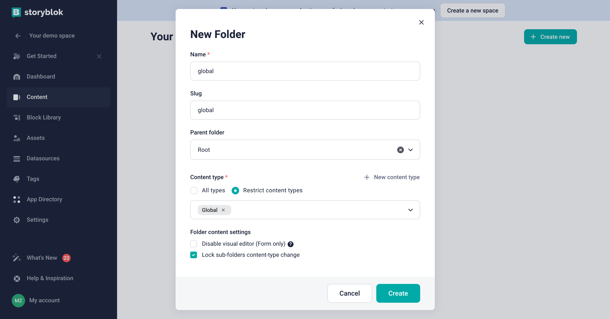

# Overview

In this article, we will integrate `Footer` with the `Storyblok CMS`. The integration will allow you to create and manage footer sections and navigation links in the `Storyblok CMS` and display them in the `Virto Commerce vue-b2b-theme`.

This guide will cover the following topics:

1. **Create of global component**: We will create a new space in `Storyblok` and add `Footer` to the space.
2. **Fetch Content from Storyblok**: We will fetch footer sections and navigation links from `Storyblok` and display them in the `vue-b2b-theme`.

## Setting Up Global Component

To set up a folder in Storyblok, we need to define a content type for the folder. Let's name it `global` as it will hold our global components. We should also ensure that the content type in the global folder cannot be changed, so that we only have entries of that type. Additionally, we should select the default content type option so that `global` is already chosen.



If you don't have a `global` content type - you can create it by clicking on the `New content type` button.


After creating the folder, we can proceed to create our first entry within it. When creating the entry, ensure that the content type is set to `global` as we have disabled the ability to change the content type for the folder. You can choose any name for the entry, but make sure it accurately describes the content of the global component to your editors. Since we are creating a `Footer`, we will name the entry `Footer`.


Next step will be to set-up the actual field in the entry that holds our component, for this we will click on `Define` and adding a new field called `global` of the type `Blocks`.


In next step we will create a new block called `footer`.

## Create Footer Block

First we will navigate to the `Block Library` menu where we will hit `New Block` on the top right corner. You will be prompted with an input field to name the component, we will use `Footer`. After confirming the name, we will add a new field called `items` of type `Blocks` and hit `Save`.


Since components in Storyblok have a block structure, we need to create blocks for each footer item and each footer link in the same way. For this, we will create the `footer_item` block and the `footer_item_link` block with the `Nestable block` type.

Example structure of the `footer_item` block:


Example structure of the `footer_item_link` block:


After creating all the blocks, we need to link them together to restrict the selection of external blocks that are not related to the `footer`. To do this, go to the settings of each block, find the entry with the type `Blocks` in the `General section`, and in the `Edit field` section, select the checkbox `Allow only specific components to be inserted` and choose the component that can be nested in this block. In our example, the nesting should look like this:

```text
Footer
    └── footer_item
            └── footer_item_link
```


Example of this configuration for the `Footer` block:


After creating all the blocks and configuring their nesting, we can proceed to create the content for our footer.

## Create Footer Content

After creating the blocks, we can proceed to create the content for our `Footer`. We will navigate to the `Content` menu and click on the `Footer` entry we created earlier. We will then click on the `Add Block` button and select the `Footer` block.


Next we will add the `footer_item` block and then the `footer_item_link` block. We will then fill in the necessary fields for each block and hit `Save`.

## Fetch Content from Storyblok and Display in vue-b2b-theme

To fetch content from Storyblok and display it in the vue-b2b-theme, we will go to the `vue-b2b-theme` and edit the `vc-footer` component. We will remove hard-coded columns and change it to the fetched ones.

The final `vc-footer` component will look like this:

=== "Template"

    ```html
    <template>
        <footer aria-label="Footer">
            <!-- Top footer -->
            <div
            v-if="!compact"
            class="hidden bg-[color:var(--color-footer-top-bg)] text-[color:var(--color-footer-top-text)] md:block print:!hidden"
            >
            <div class="container mx-auto grid grid-cols-2 gap-4 p-12 lg:grid-cols-4 xl:grid-cols-5">
                <!-- Logo column -->
                <div class="hidden xl:block">
                <VcImage :src="$cfg.logo_inverted_image" :alt="$context.storeName" class="h-9" lazy />
                </div>

                <div v-for="(col, index) in columns" :key="index">
                <div v-t="col.title" class="mb-3 text-base font-extrabold uppercase text-white"></div>
                <div class="flex flex-col space-y-1">
                    <FooterLink
                    v-for="(link, linkIndex) in col.links"
                    :key="`link_${linkIndex}`"
                    v-t="link.title"
                    :to="link.link"
                    ></FooterLink>
                </div>
                </div>
            </div>
            </div>

            <!-- Bottom footer -->
            <!-- ... -->
        </footer>
    </template>
    ```

=== "Script Section"

    ```typescript title="client-app/shared/layout/components/footer/vc-footer.vue" linenums="1"
    import { useStoryblok } from "@storyblok/vue";
    import pkg from "../../../../../package.json";
    import FooterLink from "./_internal/footer-link.vue";
    import { onMounted, ref } from "vue";

    interface IProps {
        compact?: boolean;
    }

    defineProps<IProps>();

    const { version } = pkg;

    const columns = ref([]);

    onMounted(async () => {
        columns.value =
            (await useStoryblok("global/footer", { version: "draft" })).value.content.global.find(
            (x: any) => x.component === "Footer",
            )?.items ?? [];
    });
    ```

After making the changes, the `Footer` will now be fetched from `Storyblok` and displayed in the `vue-b2b-theme`:


Now you can publish the changes in `Storyblok` and see the updated `Footer` in the `vue-b2b-theme`.
