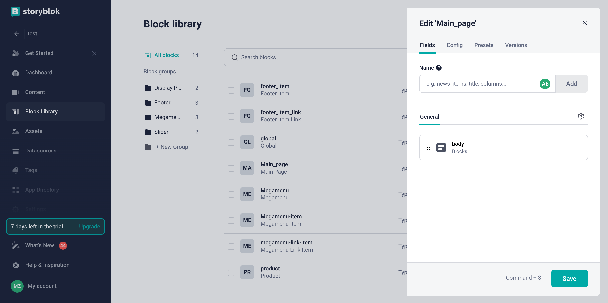
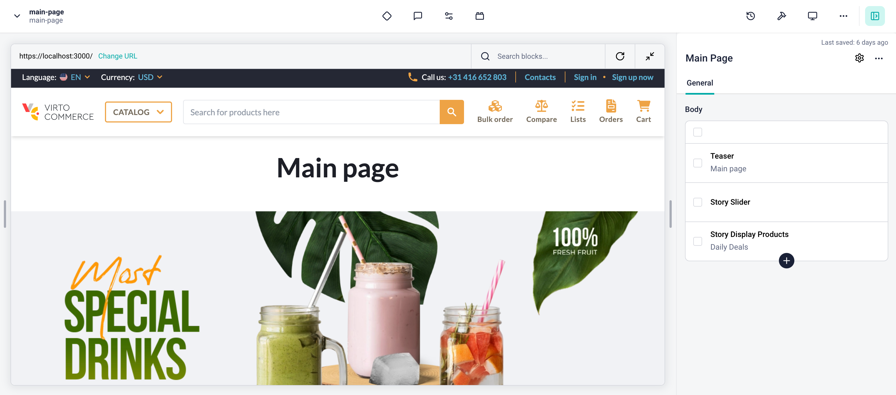

# Overview

In this article, we will integrate `Storyblok CMS` into the index page of the `Virto Commerce Storefront`. The integration will allow you to create and manage content in `Storyblok CMS` and display it in the `Virto Commerce Storefront`.

To use `Storyblok CMS` with the page you need to follow these steps:

1. **Create page model**: First, you need to create a page model in the `Storyblok CMS` for the index page. The page model should define the properties of the index page and how it should be rendered in the `Storyblok CMS`.
2. **Add Storyblok to the page component**: After creating a page model, you need to add `Storyblok` to the page component in the `Virto Commerce Storefront`. This will allow you to fetch content from `Storyblok` and display it in the index page.
3. **Create content**: After creating a page model, you can start creating content in the `Storyblok CMS`. You can create content by adding components to your page model and filling them with content.

## Create Page Model in Storyblok

First we will navigate to the `Block Library` menu where we will hit `New Block` on the top right corner. You will be prompted with an input field to name the component, we will use `Main_page`. After confirming the name, we will add a new field called `body` of type `Blocks` and hit `Save`.



Now we can use this block to create the content for our index page, so we can proceed to create the page content. We will navigate to the `Content` menu and click on the `Create new` to create new `Story` with previously created `Main Page` block:


## Add Storyblok to the Page Component

To add `Storyblok` to the page component you need to add `StoryblokComponent` into your template. As we want totally replace the content of the page with the content from `Storyblok` - we will use `v-if` directive to show `StoryblokComponent` only when `story` is loaded.

=== "Template"

    ```html title="client-app/pages/index.vue"
    <template>
        <div v-if="story">
            <StoryblokComponent v-for="(blok, index) in story?.content?.body" :blok="blok" :key="blok._uid" />
        </div>
    </template>
    ```

=== "Script"

    As you can see we are using `main-page` as a content ID to fetch the content from Storyblok.

    ```typescript title="client-app/pages/index.vue"
    import { ref } from "vue";
    import { useI18n } from "vue-i18n";
    import { usePageHead } from "@/core/composables";
    import { useStoryblok } from "@storyblok/vue";

    const { t } = useI18n();

    usePageHead({
        title: t("pages.home.meta.title"),
        meta: {
            keywords: t("pages.home.meta.keywords"),
            description: t("pages.home.meta.description"),
        },
    });

    const story = await useStoryblok("main-page", { version: "draft" });
    ```

Now you can preview the index page in the `Storyblok` and start creating content for it.

## Create content

After adding `Storyblok` to the page component, you can start creating content in the `Storyblok CMS`. You can create content by adding components to your page model and filling them with content.

!!! note
    Since the index page uses the path `/`, and `Storyblok` uses its own slugs for previews, you need to change the `Real path` in the space settings to `/`.

    

If you have already added custom components to `Storyblok`, you can use them to create content for the page. For more details on how to add custom components to Storyblok, you can read the article [Registering Custom Components](./registering-custom-components.md).

As a result, you will get integration of `Storyblok CMS` with the index page of `Virto Commerce Storefront`:


