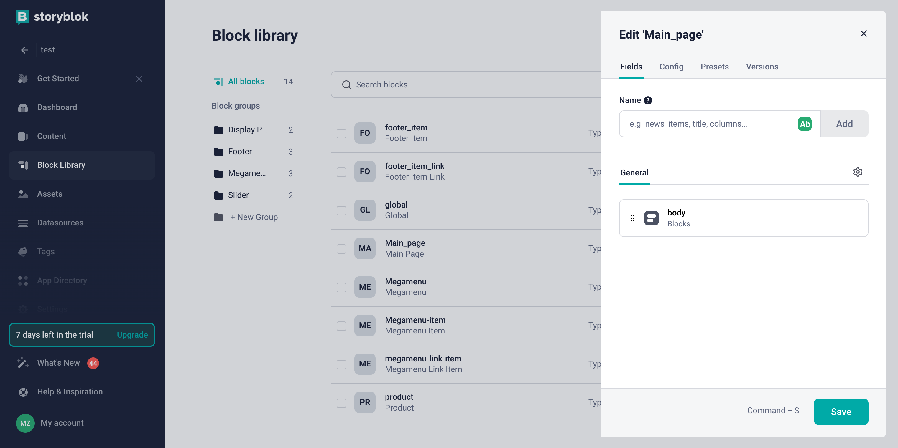
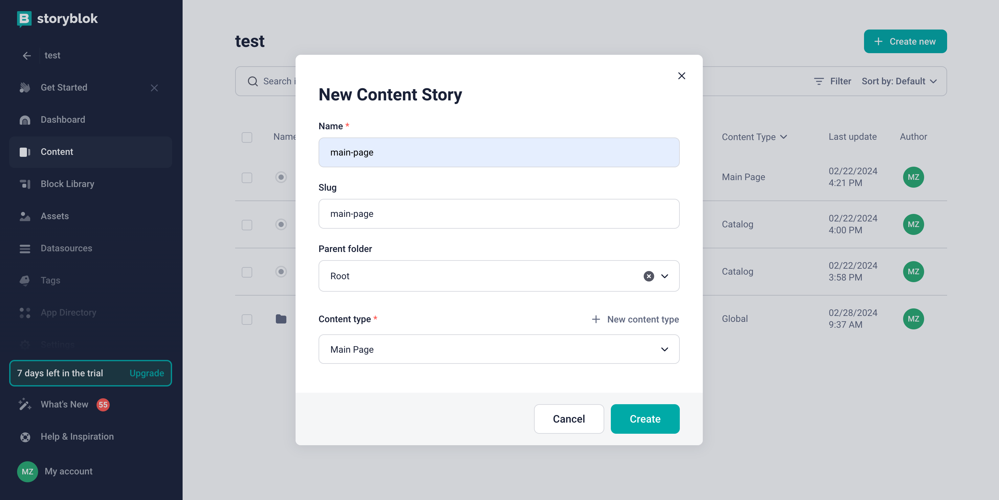
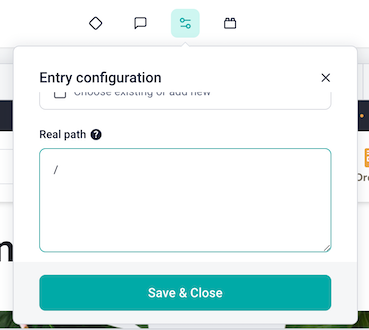
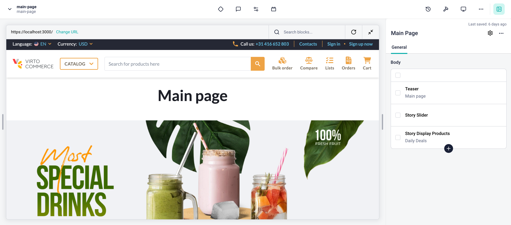

# Integrate Index Page

In this article, we will integrate Storyblok CMS into the index page of the **Virto Commerce vue-b2b-theme**. The integration will allow you to create and manage content in Storyblok CMS and display it in the **Virto Commerce vue-b2b-theme**.

To use Storyblok CMS with the page:

1. [Create page model in the Storyblok CMS for the index page](index-page-integration.md#create-page-model-in-storyblok). The page model defines the properties of the index page and how it is rendered in the Storyblok CMS.
2. [Add Storyblok to the page component in **Virto Commerce vue-b2b-theme**](index-page-integration.md#add-storyblok-to-the-page-component). This allows you to fetch content from Storyblok and display it in the index page.
3. [Create content](index-page-integration.md#create-content). Add components to your page model and fill them with content.

## Create Page Model in Storyblok

To create Page Model in Storyblok:

1. Go to the **Block Library** menu and click **New Block** in the top right corner. 
1. Enter the name of the component. We enter **Main_page** as the name. 
1. Add a new field called **body** of type **Blocks**. 
1. Click **Save** to save the changes.

    

1. Use this block to create the content for our category page: Go to the **Content** menu and click on the **Create new** to create new **Story** with previously created **Catalog** block:

    

## Add Storyblok to the Page Component

To add **Storyblok** to the page component, add `StoryblokComponent` into your template. As long as we want replace the content of the page with the content from Storyblok, we use `v-if` directive to show `StoryblokComponent` only when `story` is loaded.

=== "Template"

    ```html title="client-app/pages/index.vue"
    <template>
        <div v-if="story">
            <StoryblokComponent v-for="(blok, index) in story?.content?.body" :blok="blok" :key="blok._uid" />
        </div>
        <div v-else-if="loading" class="min-h-[80vh]">
            <VcLoaderOverlay />
        </div>
    </template>
    ```

=== "Script"

    As you can see we are using `main-page` as a content ID to fetch the content from Storyblok.

    ```typescript title="client-app/pages/index.vue"
    import { ref, toValue } from "vue";
    import { useI18n } from "vue-i18n";
    import { usePageHead } from "@/core/composables";
    import { useStoryblok } from "@storyblok/vue";

    const { t } = useI18n();

    usePageHead({
        title: t("pages.home.meta.title"),
        meta: {
            keywords: t("pages.home.meta.keywords"),
            description: t("pages.home.meta.description"),
        },
    });

    const story = ref({});

    onBeforeMount(async () => {
    try {
        loading.value = true;
        story.value = toValue(await useStoryblok("main-page", { version: "draft" }));
    } finally {
        loading.value = false;
    }
    });
    ```

Now you can preview the index page in the Storyblok and start creating content for it.

## Create Content

After adding Storyblok to the page component, start creating content in the Storyblok CMS. Add components to your page model and fill them with content.

!!! note
    Since the index page uses the path `/`, and Storyblok uses its own slugs for previews, you need to change the **Real path** in the space settings to `/`.

    

If you have already added custom components to **Storyblok**, use them to create content for the page. 

{: width="25"}  [Registering Custom Components](./registering-custom-components.md)

As a result, you will get integration of Storyblok CMS with the index page of **Virto Commerce vue-b2b-theme**:




<br>
<br>
********

<div style="display: flex; justify-content: space-between;">
    <a href="../footer-integration">← Footer integration </a>
    <a href="../registering-custom-components">Registering custom components  →</a>
</div>