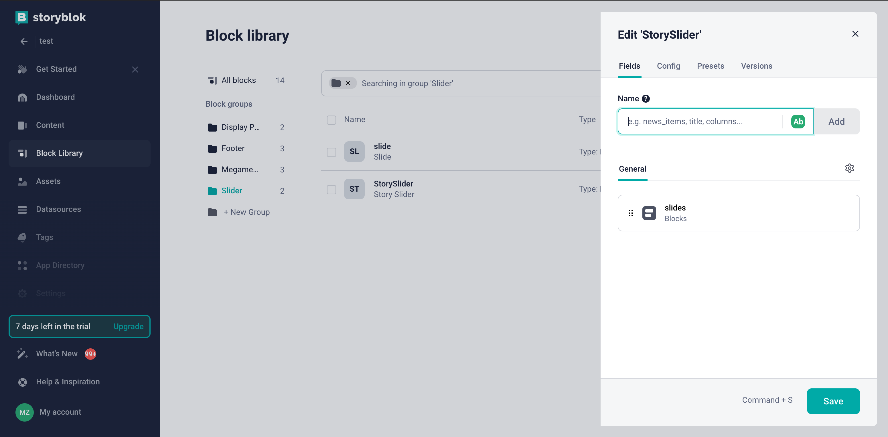
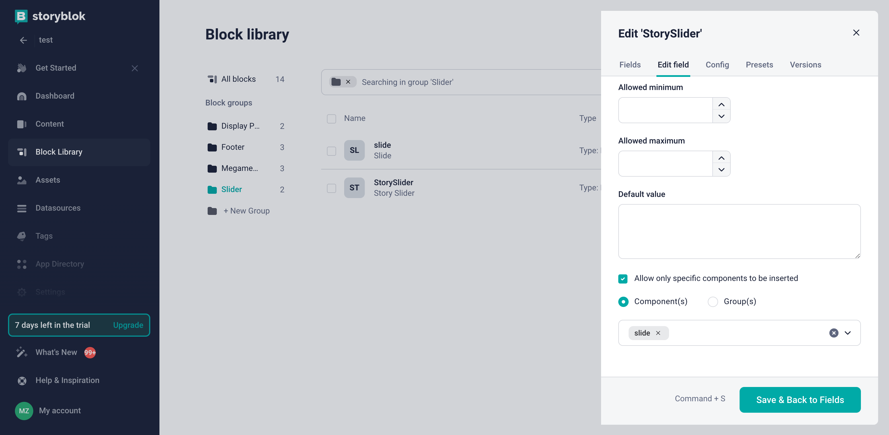

# Overview

In this article, we will explore how to register any custom component in the `Storyblok CMS`. The registration of custom components allows you to use any UI components like `Slider` in the `Storyblok CMS` when creating content.

## How to Register Custom Components

To register a custom component in the `Storyblok CMS`, you need to follow these steps:

1. **Create a wrapper component**: First, you need to create a wrapper component for the custom component you want to register. The wrapper component should be a Vue component that renders the custom component.
2. **Register the component**: After creating the wrapper component, you need to register it as a global component in your application. This will make the custom component available for use in the `Storyblok CMS`.
3. **Create component model in Storyblok**: Once the wrapper component is registered, you need to create a component model in the `Storyblok CMS` for the custom component. The component model should define the properties of the custom component and how it should be rendered in the `Storyblok CMS`.

## Example

### Registering a Slider Component in Application

Let's consider an example of how to register a `Slider` component in the `Storyblok CMS`. First, you need to create a wrapper component for the `Slider` component:

```typescript title="StorySlider.vue" linenums="1"
<template>
  <template v-if="blok">
     <Slider :id="blok?.id" v-editable="blok" :slides="blok?.slides ?? []"></Slider>
  </template>
</template>

<script lang="ts" setup>
import { default as Slider } from "@/shared/static-content/components/slider.vue";

defineProps({ blok: Object });
</script>

```

Next, you need to register the `StorySlider` component as a global component in your application:

```typescript title="client-app/app-runner.ts" linenums="1"
import { createApp } from "vue";
import App from "./App.vue";
import { StoryblokVue, apiPlugin } from "@storyblok/vue";

export default async () => {
    // ...
    const app = createApp(App);

    app.use(StoryblokVue, {
        accessToken: "27ZV5dT9mXG6tEbHraoJSwtt",
        use: [apiPlugin],
    });

    // Register your wrapper component
    app.component("StorySlider", StorySlider);

    app.mount('#app');
}
```

### Creating a Component Model in Storyblok

First we will navigate to the `Block Library` menu where we will hit `New Block` on the top right corner. You will be prompted with an input field to name the component, we will use `StorySlider`, as we need to use name of globally registered component. After confirming the name, we will add a new field called `slides` of type `Blocks` and hit `Save`.



Since components in `Storyblok` have a block structure, we need to create block for single slide in the same way. For this, we will create the `slide` block with the `Nestable block` type.

Example structure of the `slide` block:


After creating all the blocks, we need to link them together to restrict the selection of external blocks that are not related to the `StorySlider`. To do this, go to the settings of `StorySlider`, find the entry `slides` with the type `Blocks` in the `General section`, and in the `Edit field` section, select the checkbox `Allow only specific components to be inserted` and choose the component that can be nested in this block - `slide`. In our example, the nesting should look like this:

```text
StorySlider
    └── slide
```

Example of this configuration for the `StorySlider` block:



Now you can add it to the Content page to create a new `StorySlider` block!
