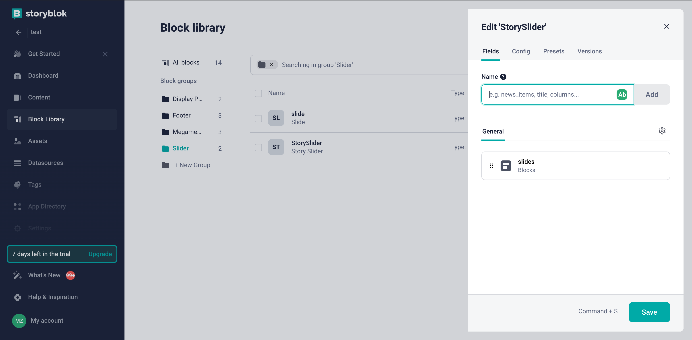
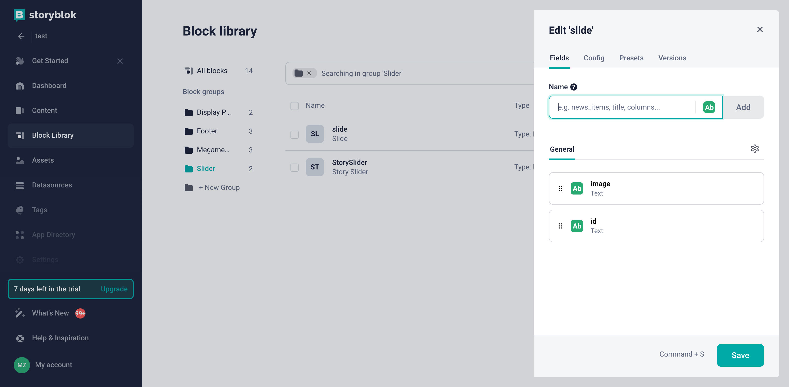

# Register Custom Components

In this article, we will explore how to register any custom component in the Storyblok CMS. The registration of custom components allows you to use any UI components like **Slider** in the Storyblok CMS when creating content.

To register a custom component in the Storyblok CMS:

1. Create a wrapper component for the custom component you want to register. The wrapper component should be a Vue component that renders the custom component.
1. Register the component as a global component in your application. This will make the custom component available for use in the Storyblok CMS.
1. Create component model in Storyblok for the custom component. The component model should define the properties of the custom component and how it should be rendered in the Storyblok CMS.

## Example. Slider Component Registration

In this example, we will show how to register a `Slider` component in the Storyblok CMS:

1. Create a wrapper component for the `Slider` component:

    ```typescript title="StorySlider.vue" linenums="1"
    <template>
    <template v-if="blok">
        <Slider :id="blok?.id" v-editable="blok" :slides="blok?.slides ?? []"></Slider>
    </template>
    </template>

    <script lang="ts" setup>
    import { default as Slider } from "@/shared/static-content/components/slider.vue";

    defineProps({ blok: Object });
    </script>

    ```

1. Register the `StorySlider` component as a global component in your application:

    ```typescript title="client-app/app-runner.ts" linenums="1"
    import { createApp } from "vue";
    import App from "./App.vue";
    import { StoryblokVue, apiPlugin } from "@storyblok/vue";

    export default async () => {
        // ...
        const app = createApp(App);

        app.use(StoryblokVue, {
            accessToken: "27ZV5dT9mXG6tEbHraoJSwtt",
            use: [apiPlugin],
        });

        // Register your wrapper component
        app.component("StorySlider", StorySlider);

        app.mount('#app');
    }
    ```

### Create Component Model in Storyblok

To create component model in Storyblok:

1. Go to the **Block Library** menu and click **New Block** in the top right corner. 
1. Enter the name of the component. We will enter **StorySlider**. 
1. Add a new field called **slides** of type **Blocks**.
1. Click **Save**.

    

1. Since components in Storyblok have a block structure, we need to create blocks for each single slide the same way. For this, we will create the **slide** block of the **Nestable block** type. The **slide** block structure can be as follows:

    


1. Link all the blocks together to restrict the selection of external blocks that are not related to the **StorySlider**:
    1. Go to the settings of the **StorySlider** to find the entry **slides** with the type **Blocks** in the **General section** and in the **Edit field** section.
    1. Check **Allow only specific components to be inserted**.
    1. Choose the component that can be nested in this block - **slide**. In our example, the nesting looks as follows:

        ```text
        StorySlider
            └── slide
        ```

        **StorySlider** block configuration can be as follows:

        

Now you can add it to the Content page to create a new StorySlider block!
