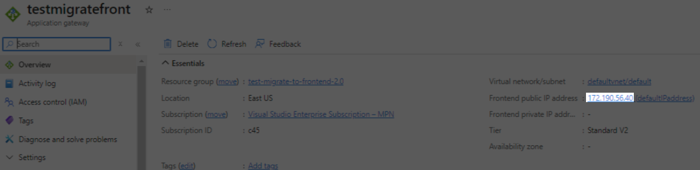

# Migration on Azure Cloud

The migration process begins with an existing Virto Commerce setup, where:

* The initial platform deployment was created using the **Deploy to Azure** button from the [Deploy VC Platform to Azure Cloud](https://docs.virtocommerce.org/platform/developer-guide/Tutorials-and-How-tos/How-tos/deploy-platform-on-azure/?h=azure) article.
* The Storefront deployment was created using the [Deploy Virto Commerce Storefront to Azure Cloud](https://portal.azure.com/#create/Microsoft.Template/uri/https%3A%2F%2Fraw.githubusercontent.com%2FVirtoCommerce%2Fvc-storefront%2Fmaster%2Fazuredeploy.json) link from the [Deploy VC Storefront to Azure Cloud](https://docs.virtocommerce.org/platform/developer-guide/Tutorials-and-How-tos/How-tos/deploy-storefront-on-azure/?h=storefront) article. 

!!! note
    If you didn’t use the **Deploy VC Platform to Azure Cloud** article and the names of the Azure resources differ (for example, the web application name is **platform** and the SQL server name is **sql-server**), you will need to modify the ARM template to match the correct names.

The result of initial deployment is as follows:

{: style="display: block; margin: 0 auto;" }

1. [Use an ARM template](https://github.com/VirtoCommerce/vc-platform/blob/dev/azureDeployPlatformAndFrontend.json) to add the necessary Azure resources for running the Platform with the Theme v.2.0.0 and higher. 
1. [Open the Azure portal](https://portal.azure.com/#create/Microsoft.Template/uri/https%3A%2F%2Fraw.githubusercontent.com%2FVirtoCommerce%2Fvc-platform%2Fdev%2FazureDeployPlatformAndFrontend.json) and provide the required Azure resources. Use the existing resource group and the name of the existing Platform Web Application. If the name of the platform application doesn’t match the existing application, the new web application will be created for the Platform.

    {: style="display: block; margin: 0 auto;" }

1. Click **Review + create**, verify the values again, and click **Create**. The deployment will begin.
1. After the deployment is complete, the resource list will look as follows (new resources are highlighted): 

    {: style="display: block; margin: 0 auto;" }

1. Add a store URL (**Stores --> B2B-store --> Store URL**) pointing to the Azure Application Gateway IP address in the format **http://x.x.x.x/**:

    {: style="display: block; margin: 0 auto;" }

1. Use the Azure Application Gateway IP address (**http://x.x.x.x/**) to access the frontend part of the Virto Commerce solution:

    {: style="display: block; margin: 0 auto;" }

1. Test the functionality, then remove the Storefront resources:

    {: style="display: block; margin: 0 auto;" }

 
 
********

    <a href="../migration">← Migration options overview</a>
    <a href="../migration-on-local-machine">Migration on local machine →</a>

