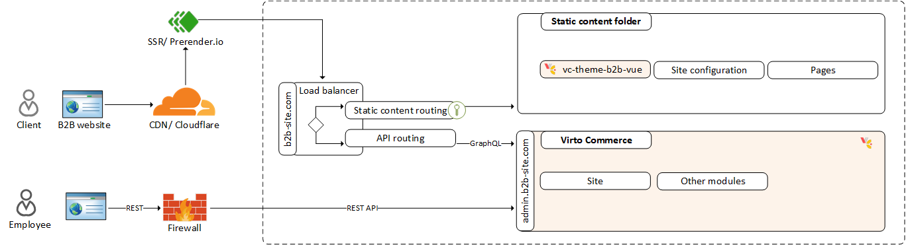

# SPA Architecture for SEO and 404 Handling

Virto Commerce Storefront is built as a Single Page Application (SPA) using Vue.js. This architecture provides fast navigation and app-like responsiveness while maintaining SEO compatibility through a combination of clean URLs, dynamic rendering, and fallback routing.

The Virto SPA architecture loads a single **index.html** file and dynamically renders content using GraphQL. Static assets such as JavaScript, CSS, images, and sitemap files are served directly by the CDN or static content server.

The request flow is as follows:

1. If a URL matches a static file, that file is returned.
1. If not, the request is routed to **index.html** with an HTTP 200 status.
1. The Vue app interprets the path (via the HTML5 History API) and renders the correct page content (e.g., **/category/widgets**).

This enables clean, shareable URLs and allows users to navigate or refresh pages without breaking.

It provides the following benefits:

* Clean URLs using history mode
* Deep linking and bookmarking
* Fast client-side navigation

!!! note
    Google recommends using the History API for SPAs to enable crawlable URLs.

## SEO and dynamic rendering with Prerender.io

One challenge of SPAs is that search engine bots may not fully execute JavaScript, which limits content visibility. Virto solves this using [Prerender](https://prerender.io), a dynamic rendering solution that generates static HTML snapshots for bots. In other words, search engines see a **server-side rendered** version, while normal users get the client-side SPA. This hybrid approach delivers the best of both worlds: crawlers see meaningful HTML content (page titles, meta tags, product info), and users still enjoy a fast single-page experience. 

This works as follows:

* A reverse proxy (e.g., Nginx) sits in front of the storefront.
* If a request comes from a known bot (Googlebot, Facebook, etc.), it is routed to Prerender.
* Prerender returns a fully rendered HTML version of the page.
* Normal users continue to get the SPA experience.

This hybrid approach ensures bots receive meaningful content while keeping performance high for users.
 

{: width="25"} [Setting up Prerender.io with Azure Application Gateway](../../../platform/developer-guide/Tutorials-and-How-tos/How-tos/setting-up-prerender-io-with-azure-app-gateway)
 

It provides the following benefits:

* Full HTML content for bots (title, meta, schema).
* No major changes required to the SPA architecture.
* Simpler than full server-side rendering (SSR).

## Handling 404s in SPA

Because Virto always serves **index.html** even for unknown URLs, the HTTP response is always 200 — even when the page doesn't exist. The Vue app handles these cases and displays a custom 404 page (e.g., the CMS page with slug **/404**). However, that error page is a **soft 404**: the browser shows an error message, but the server has already sent a 200 OK status. This is a common SPA behavior. It ensures the user sees an error page (and can navigate from it), but from the server’s point of view the request was fulfilled. 

Virto’s current SPA setup can’t immediately send a 404 status from the server for a missing route, because that would break the SPA flow (the load balancer simply forwarded the request to the app). In practice, when a page isn’t found the SPA shows the 404 content, but Googlebot still sees a 200 response – what Google calls a soft 404. 

Google suggests workarounds: for example, after determining content is missing, use a client redirect to a dedicated error URL that does return 404 (for instance, **/not-found** handled by the server) or add a **noindex** meta tag on the error page. 

!!! note
    Virto Cloud is working on support for server-side HTTP 404 responses based on route handling rules (e.g., custom Nginx logic).

## Tracking and fixing broken links

Broken links harm SEO and user experience. Virto provides tools to detect and manage them effectively:

* [Tracking with Google Analytics 4.](#tracking-with-google-analytics-4)
* [Using broken links management tool.](#using-broken-links-management-tool)

### Tracking with Google Analytics 4

* GA4 automatically logs pageviews, including visits to your 404 page
* Use a unique title (e.g., "Page not found") to filter 404s
* Use GA4 Engagement reports to identify broken URLs

In practice, you’d filter GA4 by the 404 page’s title or URL, revealing which missing-URL users (or bots) tried to access. [Analytics Mania](https://www.analyticsmania.com/post/ga4-404-error-tracking) and [MeasureSchool](https://measureschool.com/track-404-ga4) have guides on using GA4 for 404 tracking that explain this in detail.

### Using broken links management tool

[This tool](../../../platform/user-guide/seo/managing-broken-links) logs any 404 hits and lets the team mark each one for action. For example, you can ignore harmless 404s, or set client-side redirects. Virto supports internal redirects (redirecting to another page in the store) or external redirects. There’s also an option to use load balancer (or CDN) rules: for certain legacy URLs you can force a real HTTP 404 instead of letting the SPA catch it, if needed for SEO or compliance. 

In short, the workflow is: 

1. Track broken links via GA4.
1. Review them in the tool.
1. Either ignore, redirect to a new URL, or explicitly return a 404 status. 

This flexibility helps marketing teams fix SEO issues without changing code.

## Alignment with best practices

Overall, Virto’s SPA frontend aligns with current SEO best practices for modern sites. By using clean URLs (History API) and ensuring every page is reachable at a unique path, it meets Google’s recommendation to avoid hash-based routes. By integrating a pre-rendering service, it gives crawlers HTML content to index without sacrificing user experience. The SPA’s fallback to a 200-status index page is a known compromise, but Google explicitly acknowledges this pattern and suggests mitigating it via redirects or noindex tags. With GA4 and Virto’s broken-links tool, teams have visibility into **soft 404s** and can correct them through redirects (which is actually recommended over leaving **soft 404s**) or by adjusting their content.

Virto’s frontend serves static files directly and routes all other requests through the SPA (**index.html**), giving smooth in-app navigation and shareable deep links. [Prerender](http://prerender.io/)  is used to intercept bots and serve SEO-friendly HTML snapshots. Unresolved URLs still return 200+SPA 404 content (a soft 404) by default, but tools like GA4 tracking and the built-in broken links manager help teams detect and handle these cases (via redirects or ignore rules). This architecture strikes a balance between an app-like storefront and SEO needs, following guidelines from Google and SEO experts.

## Avoiding stale templates

To prevent outdated **.html** templates from being served, make sure your custom module uses the updated **webpack.config.js**. The latest setup embeds Vue templates directly into **app.js**, ensuring that the SPA always renders fresh, up-to-date content—critical for both user experience and SEO rendering via services like Prerender.

 
 
********

    <a href="../modules-architecture/modules-architecture">← Modules architecture</a>
    <a href="../deployment">Deployment →</a>

