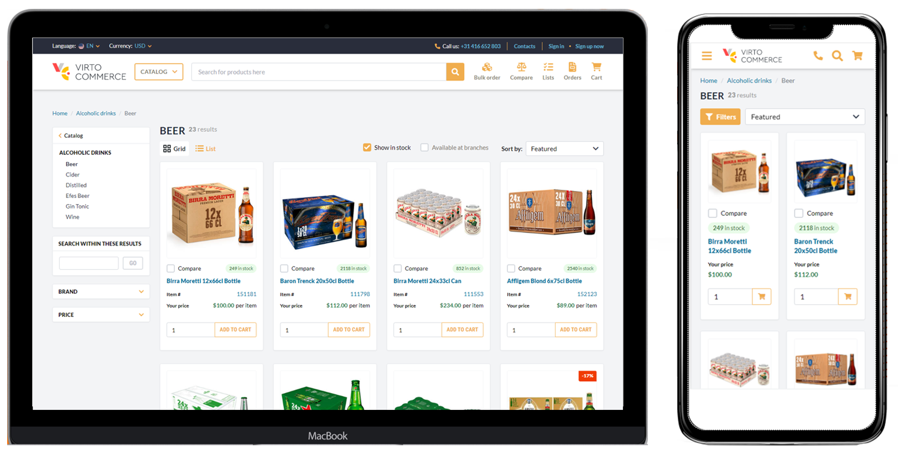
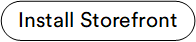


`vc-theme-b2b-vue` is a fresh look in the field of ecommerce solutions. This is a place where common B2B and B2C scenarios are combined with the most bleeding edge technologies to deliver blazing fast and fully functional solutions.

This theme represents the VC Team's opinionated starting point for new projects. It strives to include up-to-date best practices and solutions that we have deemed needed for the majority of projects we build. It is a reflection of what is possible when building a theme.

Our Vue.js Starter Theme has an adaptive design that allows it to look smooth and natural on both desktop and mobile:

## Technologies and Frameworks Used

- **[Vue3](https://vuejs.org/):** Progressive frontend framework with its key features allowing one to build fast applications.
    
- [**TypeScript**](https://www.typescriptlang.org/)**:** All components and composables have type definitions, so that IDE could help you build clean and working code.
    
- [**TailwindCSS**](https://tailwindcss.com)**:** The most popular and growing CSS framework providing wonderful flexible structure to speed up styling.
    
- **Husky + ESLint + Prettier:** Autoformat, check, and fix your code and prevent ugly code style within repository.
    
- [**Vite**](https://vitejs.dev/)**:** Faster than Webpack, it is used to develop code with HMR benefits and build for production.
    
- [**GraphQL**](https://graphql.org/) **:** Use flexible GraphQL queries and mutations to safely work with back end.

## Key Non-functional Capabilities

- **Development performance:** Thanks to maximum reusing of exciting developer experience, such as server side functionality, web components and views, and ready made theme architecture, the risk of wrong design decisions for new projects is drastically reduced.
    
- **Client performance:** We are supposed to reach and hold green metrics provided by Google PageSpeed Insights.
    
- **Decoupled structure:** Presentation layer is decoupled from back end. Shared logic is decoupled from visual components. As a developer, you can concentrate on a single task without the need of massive code manipulations.
    
- [**Atomic Design Pattern**](https://virtocommerce.com/atomic-architecture)**:** Theme UI is based on atoms, molecules, and organisms, combined within pages and shared components. This provides a high level of code reusability.
    
- **Simple styling and theme customization:** We use TailwindCSS to provide the easiest and most convenient way of CSS usage. Write as less code as possible and reuse the existing highly customizable framework features.
    
- **Fully aligned with Virto Commerce platform:** This theme is just a visual representation, we are fully aligned with the platform to provide all common B2B and B2C scenarios Virto Commerce platform provides.
    
- **Fully responsive:** We made our theme work on a number of devices, including desktop and mobile, being focused both on UI and UX.
    
- Ultimate **starting point** for all new themes
    
- **SEO friendly** thanks to **SSR** (Server Side Rendering) running on the VC Storefront [ASP.NET](http://ASP.NET) Core and Liquid pages.
    

## Key Functional Capabilities

!!! note
	Asterisk (*) means the feature is stil under development.

### Security

- Sign In/Out/Up
    
- Reset password
    
- Forgotten user name *
    
- Remember me *
    
- 2F Authentication (email, phone) *
    
- SSO with Social networks (Google, Facebook) *
    
- Login on Behalf
    
- Anonymous shopper 

### Navigation Elements

- Main header (logo, main mega menu, cart widget, account, store/language/currency selector)
    
- Main footer (contact data, social networks)

### Product page

- Product image gallery *
    
- Zoom images *
    
- SKU/Variant selector
    
- Product description
    
- Product properties
    
- List/sale price, discount amount
    
- Inc/Exl VAT *
    
- Availability information
    
-  Tier prices *
    
- Breadcrumbs
    
- Cross selling/related products *

### Cart

- Cart widget
    
- Add to cart button
    
- Enter multiple coupons *
    
- Cart items price/availability changed validation messages
    
- Clean cart
    
- Change cart items quantity
    
- Remove cart item
    
- Cart running totals
    
- Display list/sale prices and discount for cart items *
    
- Inc/Exl VAT *

### Checkout

- Single-page checkout
    
- Multi-page checkout *. Dynamic checkout routing
    
- Anonymous checkout
    
- Enter shipping/billing addresses
    
- Select shipping/payments methods from list
    
- Select desired delivery date from delivery calendar
    
- Two types of payment methods (within the website and externally)
    
- Use billing/shipping preferences
    
- Enter multiple coupon codes *
    
- Estimated totals (grand total, subtotal, shipping cost, tax, discount)
    
- Order place confirmation
    
- Thank you page

### Personal Data and Profile

- Edit shipping/billing preferences, addresses *
    
- Edit first/last name, phone, email *
    
- Change password *
    

### Company Account

- Manage company details and addresses
    
- Manage company users (invite, block, delete)
    
- Manage user roles
    

### Wishlist

- Manage lists
    
- Manage product quantities in the list (save as order template)
    
- Create order from list and add products to cart

### Quote Request (RFQ)

- Add/remove products from quote
    
- Quote requests history
    
- Review quote request
    
- Place and order from quote

### Compare Product List

- Add product to compare list
    
- Compare products view    

### Order History

- See order history list with pagination *
    
- See order details *
    
- Search by keyword
    
- Sort
    
- Reorder

### Searching, Filtering, and Product Results

- FTS (Full text search)
    
- Search suggestions and autocomplete (products and categories)
    
- Faceted/taxonomy based search (search in the selected category or filter)
    
- Faceted/taxonomy filtering (properties, prices, categories, brands, availability)
    
- Edit selected filters
    
- Two search result view types (list, tile)
    
- Pagination *
    
- Sorting
    
- Breadcrumbs 

### Category Taxonomy

- See a tree of categories in the filter bar
    

### Routing

- Share a filtered set of results with URL
    
- Share a paginated result page (e.g., page 2 or page 3)
    
- Slug routing for category or product

### Muti-currency

- Currency selector
    
- Shopping cart per currency
    

### Localization

- Adapt to date/time/number format differences *
    
- Automatically translate theme static resources into another language *
    
- Language selector
    

### Maintenance Pages

- 404, 401, and 500 pages
    

### Protection of Personal Data and GDPR Compliance

- Cookie consent *  

## Working with `vc-theme-b2b-vue`

As a developer, you will be using `vc-theme-b2b-vue` as your ultimate starting point for a new theme. It contains numerous out-of-the-box features that are typical for B2B and B2C ecommerce projects. Along with ready made theme architecture and huge set of reusable components, it can significantly speed up your development process. To start developing a new theme, you just need to clone (fork) the theme project, and then you will be able to do any customization according to your needs.<!---Link to custom theme development-->

    

