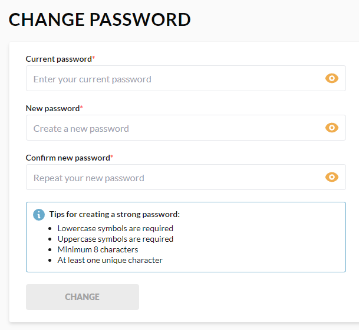

# Change Password

In this section, you can change your current password according to the listed tips:

 
 
********

    <a href="../profile">← Profile</a>
    <a href="../addresses">Addresses →</a>

