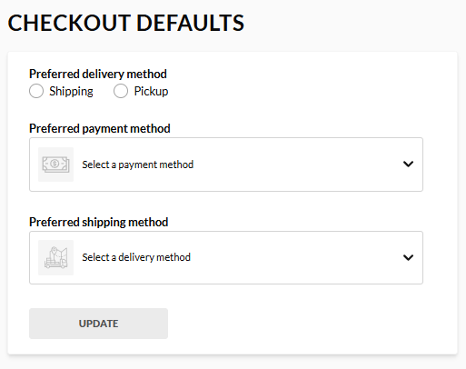

# Checkout Defaults

To simplify the checkout process, users can preset their checkout defaults. This way, users do not have to specify them every time they check out. 

These include:

* Preferred delivery method (shipping or pickup).
* Preferred payment method (bank card or manual).
* Preferred shipping method (air or ground).

{: style="display: block; margin: 0 auto;" }

 
 
********

    <a href="../lists">← Lists</a>
    <a href="../quote-requests">Quote requests →</a>

