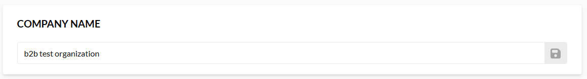

# Company Info

The **Company info** section contains the following widgets:

* **Company name** to edit and save company name:

    

* **Company logo** (for admins) to upload company logo in JPG and PNG format not exceeding 4.8 MB:

    

* **Addresses** to add, delete, or add company addresses to favorites, including billing and delivery addresses:

    

    !!! info
        The favorite address will automatically appear at the top of the address list in the Company Info section and during checkout.

 
 
********

    <a href="../purchase-requests">← Purchase requests</a>
    <a href="../company-members">Company members →</a>

