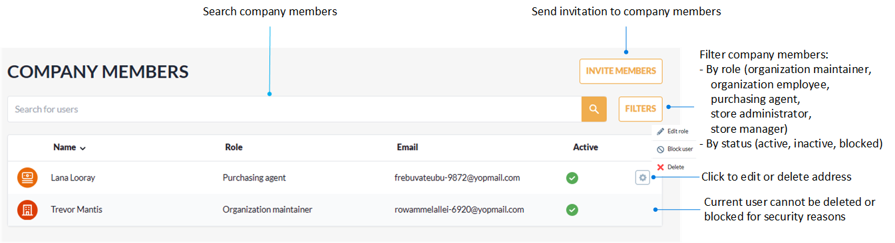
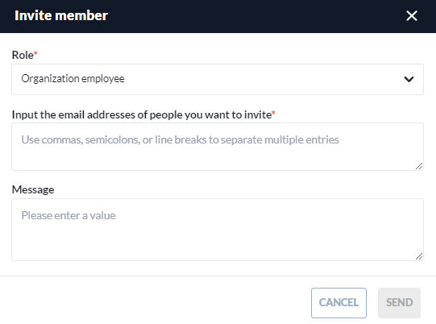
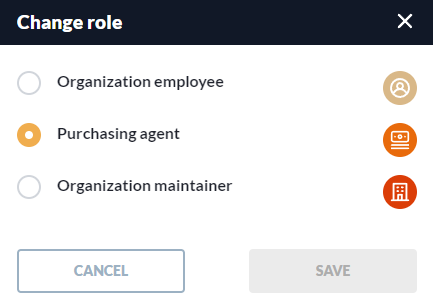

# Company Members

The **Company members** section contains a list of the invited company members.

In this section, you can:

* Send invitations to new members.
* Manage members access by blocking, unblocking, or deleting them.
* Edit roles. 
* Filter company members by their role and status.

## Invite company members

To send invitations to company members:

1. Click **Invite members**.
1. Fill in the following fields:

    

1. Click **SEND** to invite new members.

The recipients will get your invitation via email.

## Block, unblock, delete company members

To block/ unblock/ delete company members from the list:

1. Click {: width="20"} next to the name of the required user.
1. Click **Block**, **Unblock**, **Delete** from the drop-down menu.
1. Confirm your action.

The user has been successfully blocked/ unblocked/ deleted from the list.

## Edit user role

To edit user role:

1. Click {: width="20"} next to the name of the required user.
1. Click **Edit role** from the drop-down menu.
1. Select the role from the list:

    

1. Click **SAVE** to save the changes.

The role has been successfully modified.

 
 
********

    <a href="../company-info">← Company info</a>
    <a href="../../shopping/products-purchase-options">Shopping process →</a>

