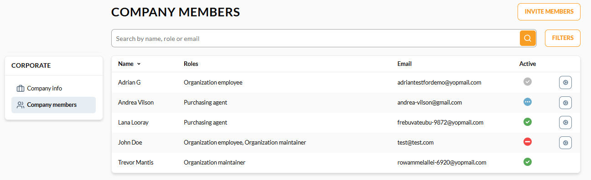
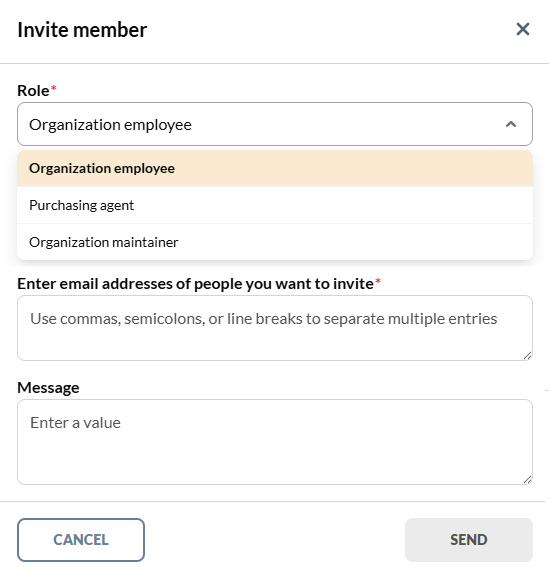
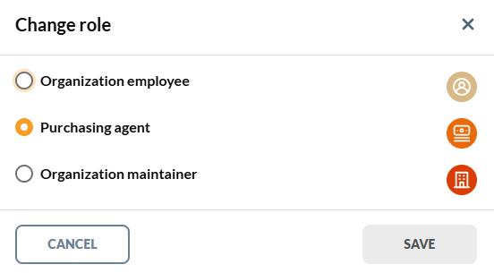

# Company Members

The **Company members** section contains a list of the invited company members.

In this section, you can:

* [Send invitations to new members.](#invite-company-members)
* [Manage members access by blocking, unblocking, or deleting them.](#block-unblock-delete-company-members)
* [Edit roles.](#edit-user-role) 
* Filter company members by their role and status.
* Log in on behalf of any member if you have the required permissions.

{: style="display: block; margin: 0 auto;" }

## Invite company members

To send invitations to company members:

1. Click **Invite members**.
1. Fill in the following fields:

    {: style="display: block; margin: 0 auto;" }

1. Click **SEND** to invite new members.

The recipients will get your invitation via email.

## Block, unblock, delete company members

To block/ unblock/ delete company members from the list:

1. Click {: width="20"} next to the name of the required user.
1. Click **Block**, **Unblock**, **Delete** from the drop-down menu.
1. Confirm your action.

The user has been successfully blocked/ unblocked/ deleted from the list.

## Edit user role

To edit user role:

1. Click {: width="20"} next to the name of the required user.
1. Click **Edit role** from the drop-down menu.
1. Select the role from the list:

    {: style="display: block; margin: 0 auto;" }

1. Click **SAVE** to save the changes.

The role has been successfully modified.

## Log in on behalf of company member

Login on behalf lets an authorized organization member access the storefront as a colleague in the same organization to continue their work. You can browse catalogs, complete carts, place orders, and use company account features without needing their password. 

Try our interactive demo to explore this features in action:

  
  

    <iframe loading="lazy" class="sl-demo" src="https://app.storylane.io/demo/clzzoz4ouudq?embed=inline" name="sl-embed" allow="fullscreen" allowfullscreen style="position:absolute;top:0;left:0;width:100%!important;height:100%!important;border:1px solid rgba(63,95,172,0.35);box-shadow: 0px 0px 18px rgba(26, 19, 72, 0.15);border-radius:10px;box-sizing:border-box;"></iframe>
  

 
 
********

    <a href="../company-info">← Company info</a>
    <a href="../profile">User profile →</a>

