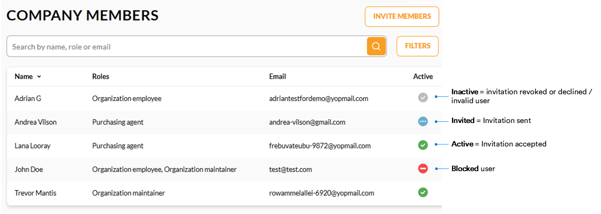
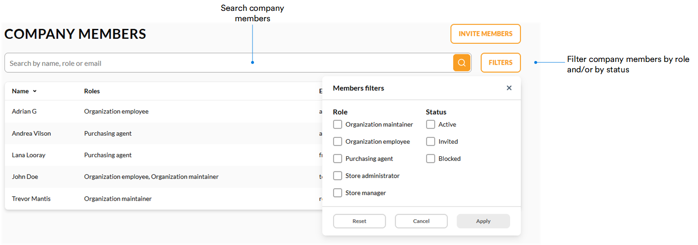
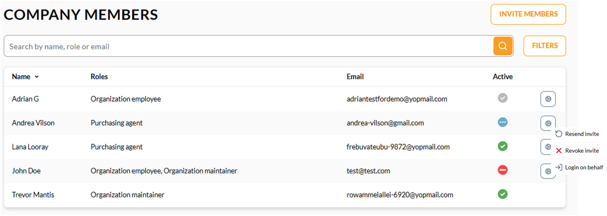
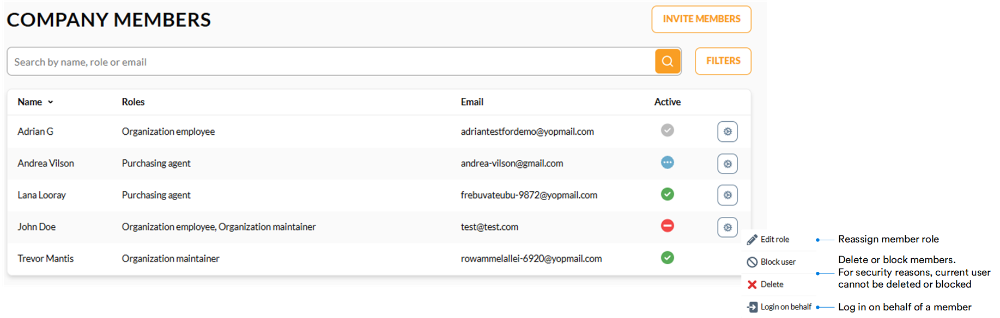
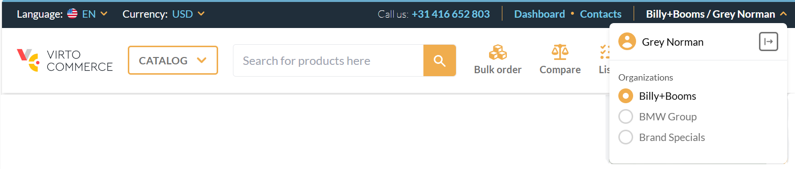
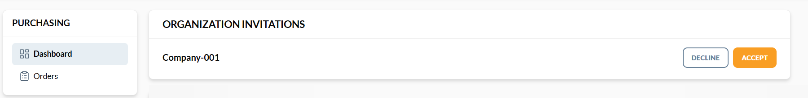

# Company Members

The **Company members** page lists everyone invited to your company.

{: style="display: block; margin: 0 auto;" }

In this section, you can:

* [Understand your status in each company.](#understand-your-status-in-each-company)
* [Find and filter members.](#find-and-filter-members)
* [Invite someone to join your company.](#invite-users)
* [Manage a pending invitation.](#manage-pending-invitation)
* [Edit company members.](#edit-company-members)
* [Switch between your companies.](#switch-between-your-companies)
* [Accept or decline an invitation to a new company.](#accept-or-decline-invitation)

## Prerequisites

Before managing company members, make sure you have:

* A corporate account.
* Permission to manage members.

Open **Company members** from the **Corporate** group in your account menu.

## Understand your status in each company

Each member shows one of four statuses in the **Active** column: 

{: style="display: block; margin: 0 auto;" }

Your administrator sets your status separately for each company you belong to. You might be **Active** in one company and **Invited** in another at the same time.

## Find and filter members

To find a specific member, type a name, role, or email into the **Search by name, role or email** box, or click **Filters**.

{: style="display: block; margin: 0 auto;" }

## Invite users

To send invitations to company members:

1. Click **Invite members**.
1. Fill in the following fields:

    {: style="display: block; margin: 0 auto;" }

    !!! info
        You can invite a person using an email address they already use elsewhere. Their membership in your company is tracked separately from any other company they belong to. If they tell you they can no longer sign in at all right after your invitation arrives, [revoke it](#manage-pending-invitation) and ask them to try again.

1. Click **Send**.

The invitee appears in your member list immediately, showing **Invite sent**, until they complete registration.

## Manage pending invitation

To edit pending invitations:

1. Click {: width="20"} next to the name of the required user.
1. Resend or revoke your invitation or [log in on behalf of the selected user](#log-in-on-behalf-of-company-member):

## Edit company members

As soon as the invited user accepts the invitation they become a company member. Editing company members includes:

* [Editing user roles.](#edit-user-roles)
* [Blocking, unblocking, and deleting company members.](#block-unblock-delete-company-members)
* [Logging in on behalf of a company member.](#log-in-on-behalf-of-company-member)

### Edit user roles

Every person in your company can hold more than one role at the same time. On the Company members page you can see all the roles each member has.

Every company member can hold two kinds of roles combined:

* **Organization-level roles** assigned to your whole organization by your platform administrator. Every member inherits them automatically; you do not add them person by person.
* **Individual roles** assigned to one specific member, such as Organization maintainer or Purchasing agent.

To edit an individual role:

1. Click {: width="20"} next to the name of the required user.
1. Click **Edit role** from the dropdown menu.
1. Select the role from the list:

    {: style="display: block; margin: 0 auto;" }

1. Click **Save** to save the changes.

The role has been successfully modified.

!!! info
    A role change takes effect the next time the member signs in.

### Block, unblock, delete company members

To block, unblock, or delete a company member from the list:

1. Click {: width="20"} next to the name of the required user.
1. Click **Block**, **Unblock**, or **Delete** from the dropdown menu.
1. Confirm your action.

Deleting a member sets their status to **Inactive**; their row stays in the list.

### Log in on behalf of company member

Login on behalf lets an authorized organization member access the Frontend as a colleague in the same organization to continue their work. You can browse catalogs, complete carts, place orders, and use company account features without needing their password.

Try our interactive demo to explore key features in action:

  
  

    <iframe loading="lazy" class="sl-demo" src="https://app.storylane.io/demo/clzzoz4ouudq?embed=inline" name="sl-embed" allow="fullscreen" allowfullscreen style="position:absolute;top:0;left:0;width:100%!important;height:100%!important;border:1px solid rgba(63,95,172,0.35);box-shadow: 0px 0px 18px rgba(26, 19, 72, 0.15);border-radius:10px;box-sizing:border-box;"></iframe>
  

## Switch between your companies

If you belong to more than one company, open your account menu and look under **Organizations**. Every company you belong to is listed, with your current one marked:

{: style="display: block; margin: 0 auto;" }

Select a different company from this list to work in it. Only companies you currently have access to appear here.

## Accept or decline invitation

When someone invites you into their company, open **Account** → **Dashboard**. A card titled **Organization invitations** lists each pending invitation with **Accept** and **Decline** buttons:

Accepting adds that company to your list under **Organizations**. Declining removes the invitation without affecting any company you already belong to.

 
 
********

    <a href="../company-info">← Company info</a>
    <a href="../sales-reps">Sales reps →</a>

