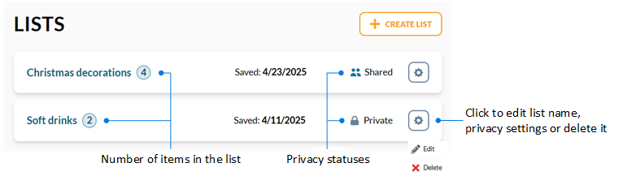
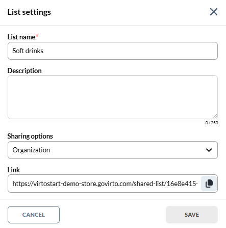
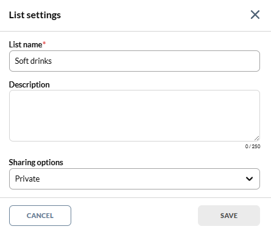
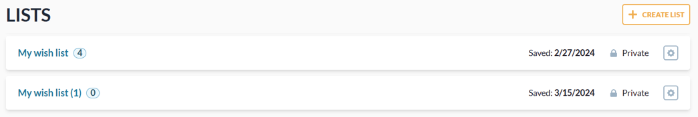
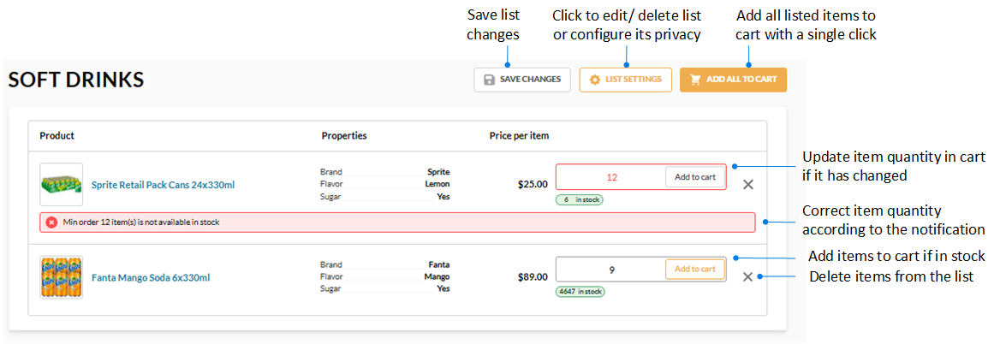
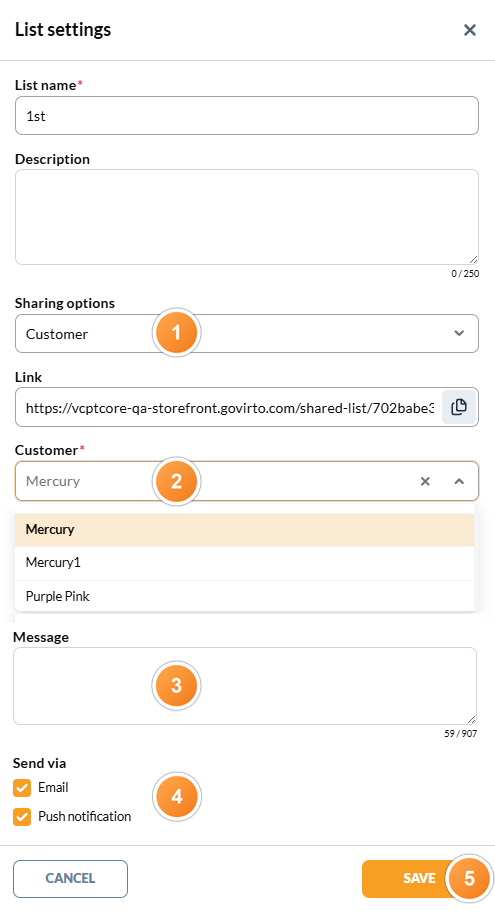
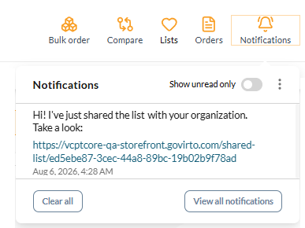

# Lists

The lists help users save items they are interested in for future consideration. The **Lists** section contains all the product lists created by the user. You can also quickly access the **Lists** section through the **Lists** button in the top menu. 

{: style="display: block; margin: 0 auto;" width="800"}

## Manage lists

In the **Lists** section, you can:

* Create new lists.
* View number of items in the list.
* Edit lists names.
* Delete lists.
* Configure lists privacy. Users can share their shopping lists with configurable access scopes:

    * Private (no sharing link).
    * Organization (shared within organization members).
    * Anyone (readonly) (shared via public view-only link).
    * [Customer (shared with sales rep's customers)](#share-lists-with-customers):

    

    -   __Shareable list:__

        ---

        

    -   __Private list:__

        ---

        

    

!!! note
    If you attempt to save a new list with a name that already exists, the system automatically appends a number to differentiate it, indicating how many lists share that name.

    {: style="display: block; margin: 0 auto;" }

Click the desired list to view its details. Here you can:

* Add all the listed items to cart with a single click.
* Add specific listed items to cart.
* Update the amount of items in cart.
* Delete items from the list.
* Edit list by clicking **List settings**.
* Purchase list items separately from cart. This allows customers to manage and purchase items from a list without affecting their shopping cart.

### Share lists with customers

Sales reps can share lists with their customers individually:

1. Select **Customer** from the sharing options dropdown.
1. Select a customer to share the list with from the dropdown that appears. If the list was previously shared with another customer, that customer will loos access to it.
1. Optionally, add a message. If you don't, the customer will receive a default message.
1. Click **SAVE** to send the list to the customer. The list will be sent via email and push notification.

    {: style="display: block; margin: 0 auto;" width="400"}

The customer receives the notification:

{: style="display: block; margin: 0 auto;" }

 
 
********

    <a href="../orders">← Orders</a>
    <a href="../quote-requests">Quote requests →</a>

