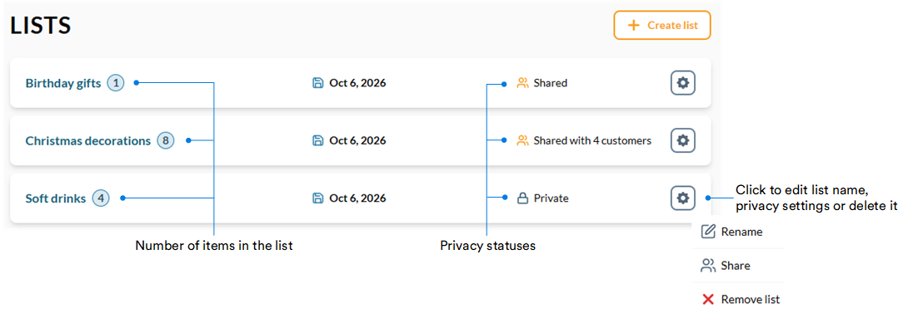
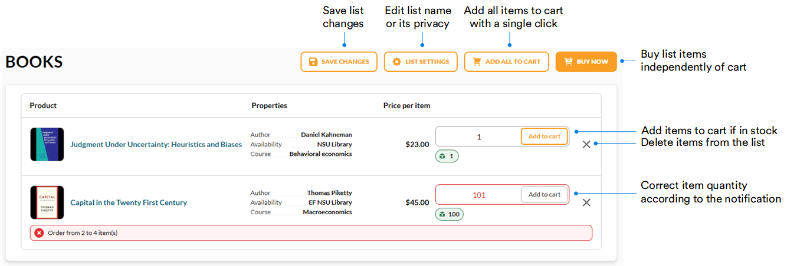
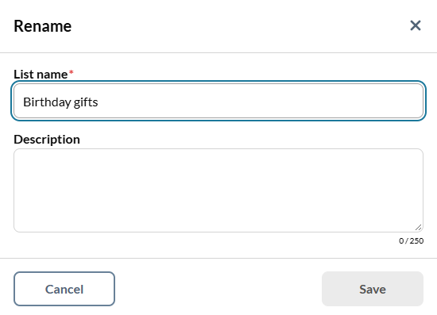
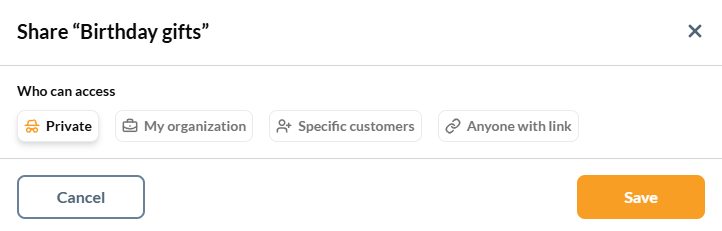
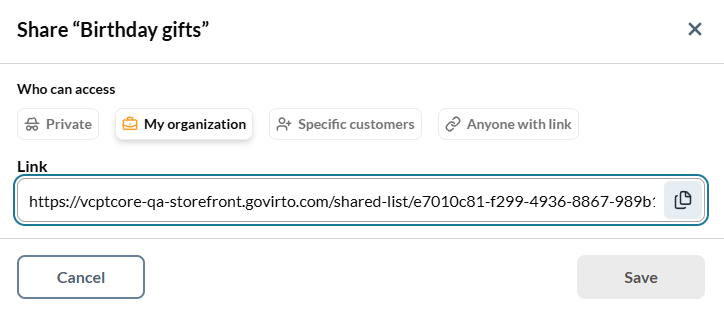
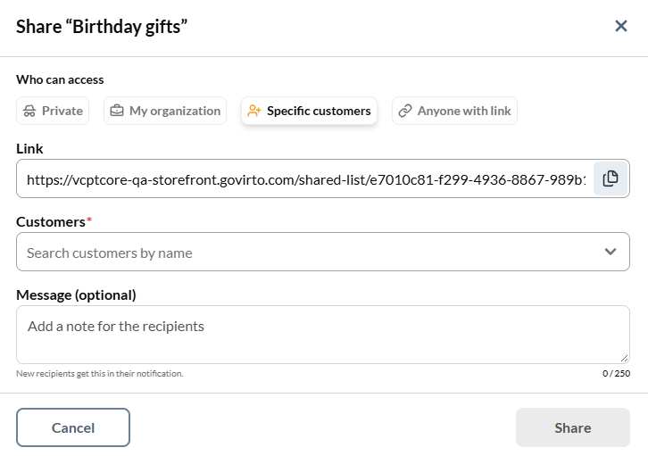
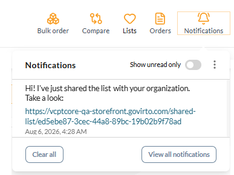
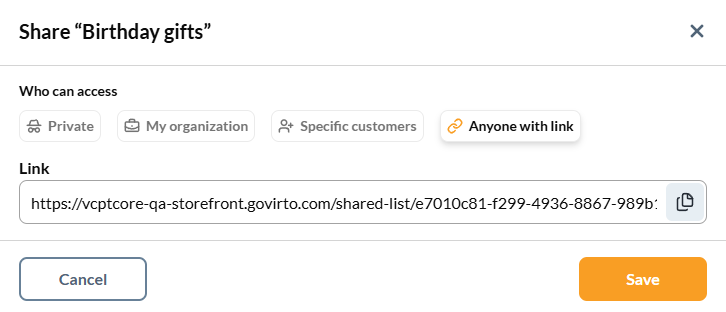

# Lists

The lists help users save items they are interested in for future consideration. The **Lists** section contains all the product lists created by the user. You can also quickly access the **Lists** section through the **Lists** button in the top menu. 

In the **Lists** section, you can:

* Create new lists by clicking **Create list**. 

    !!! note
        If you attempt to save a new list with a name that already exists, the system automatically appends a number to differentiate it, indicating how many lists share that name.

* View number of items in the list.
* [Edit list name](#edit-list-name).
* [Configure lists privacy](#share-list).
* Delete lists.

{: style="display: block; margin: 0 auto;" }

Click the desired list to view its details. Here you can:

* Add all the listed items to cart with a single click.
* Add specific listed items to cart.
* Update the amount of items in cart.
* Delete items from the list.
* Edit list by clicking **List settings**.
* Purchase list items separately from cart. This allows customers to manage and purchase items from a list without affecting their shopping cart.

## Edit list name

To edit a list name:

1. Click {: width="20"} next to the list name.
1. Click **Rename** in the popup menu.
1. Configure the list name and description:

    {: style="display: block; margin: 0 auto;" }

1. Click **Save**.

Your modifications have been applied.

## Share list

To share a list:

1. Click {: width="20"} next to the list name.
1. Click **Share** in the popup menu.
1. Select one of the following privacy options:
    
    === "Private" 

        {: style="display: block; margin: 0 auto;" }

    === "My organization"

        {: style="display: block; margin: 0 auto;" }

        The list appears among the lists of your organization members.

    === "Specific customers (for sales reps)"

        {: style="display: block; margin: 0 auto;" }

        The customer receives the notification:

        {: style="display: block; margin: 0 auto;" }

    === "Anyone with link"

        {: style="display: block; margin: 0 auto;" }

1. Click **Save**.

Your modifications have been applied.

 
 
********

    <a href="../orders">← Orders</a>
    <a href="../quote-requests">Quote requests →</a>

