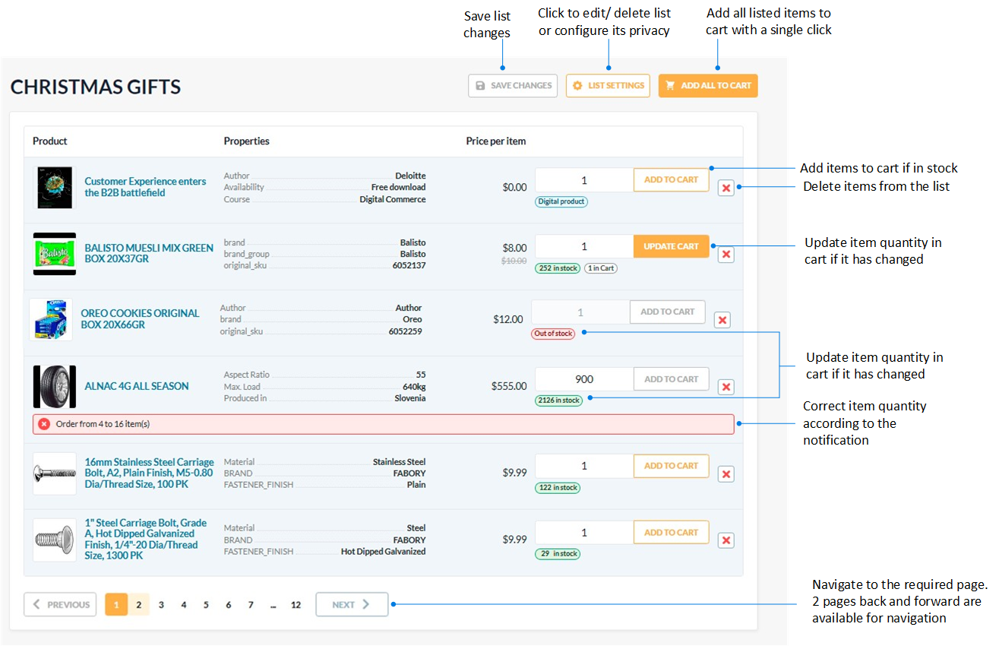

# Lists

The lists help users save items they are interested in for future consideration. The **Lists** section contains all the product lists created by the user. You can also quickly access the **Lists** section through the **Lists** button in the top menu. 

In the **Lists** section, you can:

* Create new lists.
* Configure lists privacy.
* View number of items in the list.
* Edit lists names.
* Delete lists.

{: style="display: block; margin: 0 auto;" width="800"}

!!! note
    If you attempt to save a new list with a name that already exists, the system automatically appends a number to differentiate it, indicating how many lists share that name.

    

Click on the desired list to view its details. Here you can:

* Add all the listed items to cart with a single click.
* Add specific listed items to cart.
* Update the amount of items in cart.
* Delete items from the list.
* Edit list by clicking **List settings**.
* Purchase list items separately from cart (as of [Frontend 2.29.0](https://github.com/VirtoCommerce/vc-frontend/releases/tag/2.29.0)). This allows customers to manage and purchase items from a list without affecting their shopping cart.

## Edit lists

To edit a list:

1. Click {: width="20"} to the right of the list name.
1. In the popup menu, click **Edit** to open the list settings.
1. Update the list name, its description, or check the **Private list** setting to make the list invisible for other company members.

    {: style="display: block; margin: 0 auto;" width="500"}

1. Click **Save** to save the changes.

You modifications have been saved.

 
 
********

    <a href="../review-products">← Product reviews</a>
    <a href="../checkout-defaults">Checkout defaults →</a>

