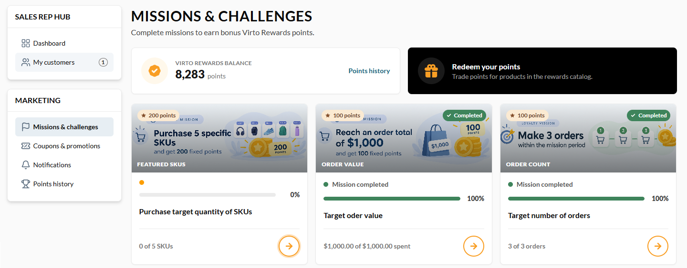
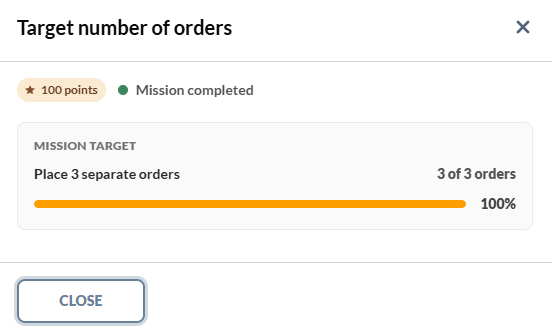
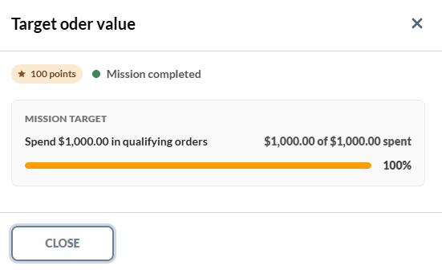
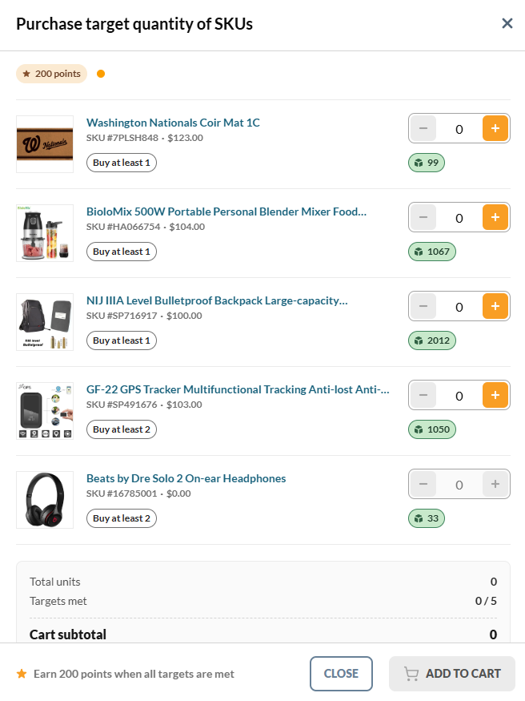

# Missions and Challenges

Missions are goal-driven campaigns that automatically award a predefined number of points when customers achieve a specific target, such as reaching an order value, placing a certain number of orders, or purchasing specific SKUs. 

In the **Missions and challenges** section, users can view available loyalty missions, open any mission to see its goal and track the current progress:

{: style="display: block; margin: 0 auto;" }

There are three types of missions:

=== "Buy a target number of orders"

    

=== "Reach a target order value"

    

=== "Buy a target quantity of SKUs"

    !!! note
        Users can buy the required SKUs directly from the mission progress window.

    

 
 
********

    <a href="../back-in-stock-list">← Back-in-stock list</a>
    <a href="../coupons">Coupons and promotions →</a>

