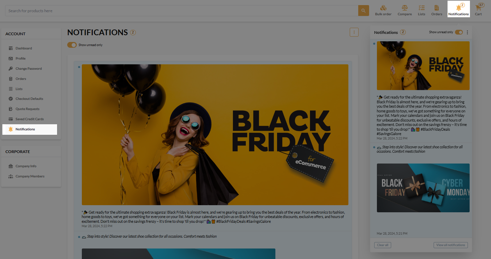
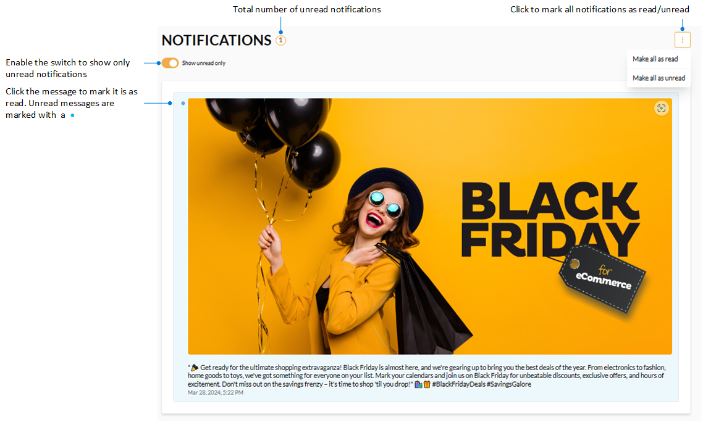

# Notifications

Users can view all notifications sent to them by sellers in the **Notifications** sections:

You can read the messages received, view their total amount, mark notifications as read or unread:

 
 
********

    <a href="../coupons">← Coupons and promotions</a>
    <a href="../points-history">Points history →</a>

