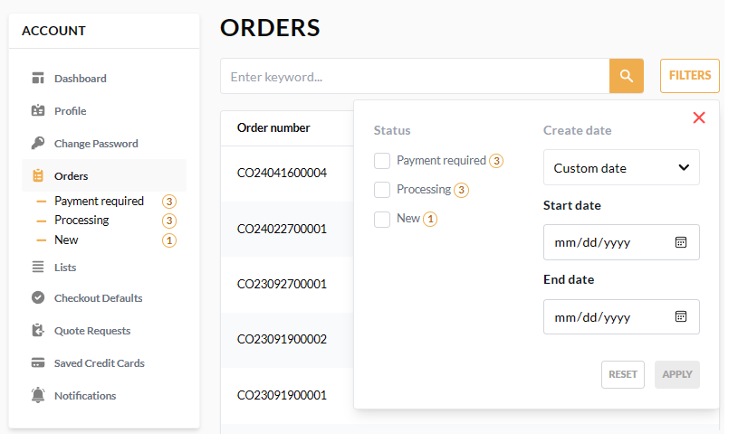

# Orders

The **Orders** section lists all the user's orders, including order number, invoice number, order date, current status, and total order amount.

Here you can:

* Search for orders by keyword.
* Navigate to the order details page.
* Filter orders by status, date of creation, and date range:

    

    !!! note 
        In the left menu, you can immediately see all orders sorted by status, without having to apply any filters.  

To view the order details, click on the desired order in the orders list. The order details open in a new window:

Here you can:

* View the list of the ordered items grouped by vendor.
* View order totals and subtotals, including prices per item, shipping costs, taxes, etc.
* View shipping and billing details. 

    !!! note
        Shipping method and shipping address appear only for physical products.

* Print your order information.
* Pay for the order in case of **Payment required** status.
* Re-order all items from the completed orders:

    