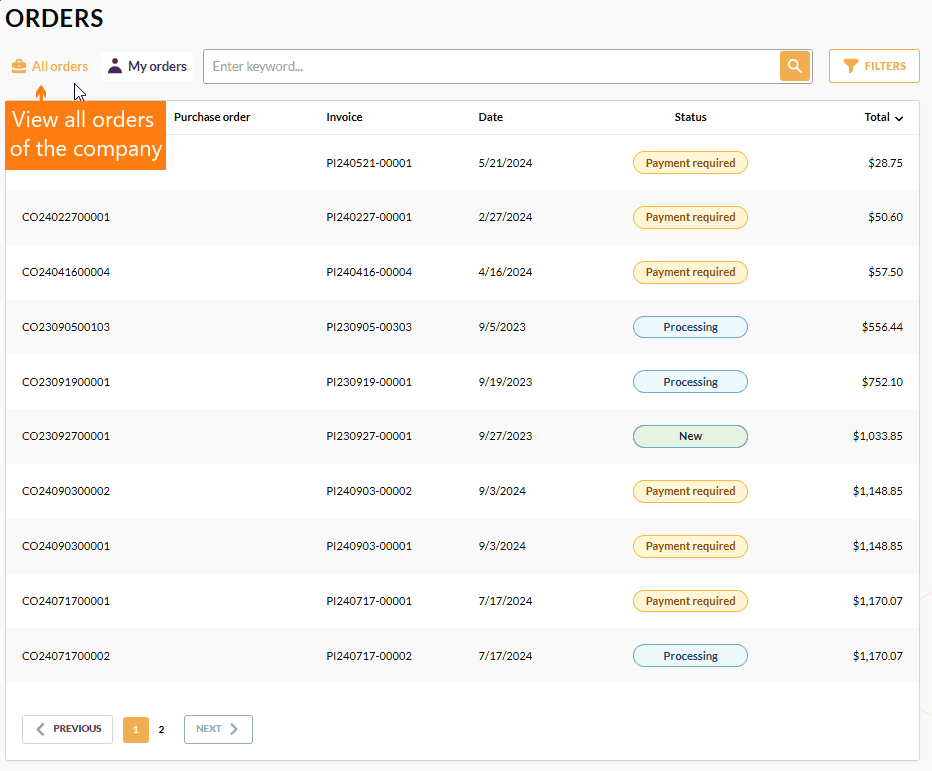
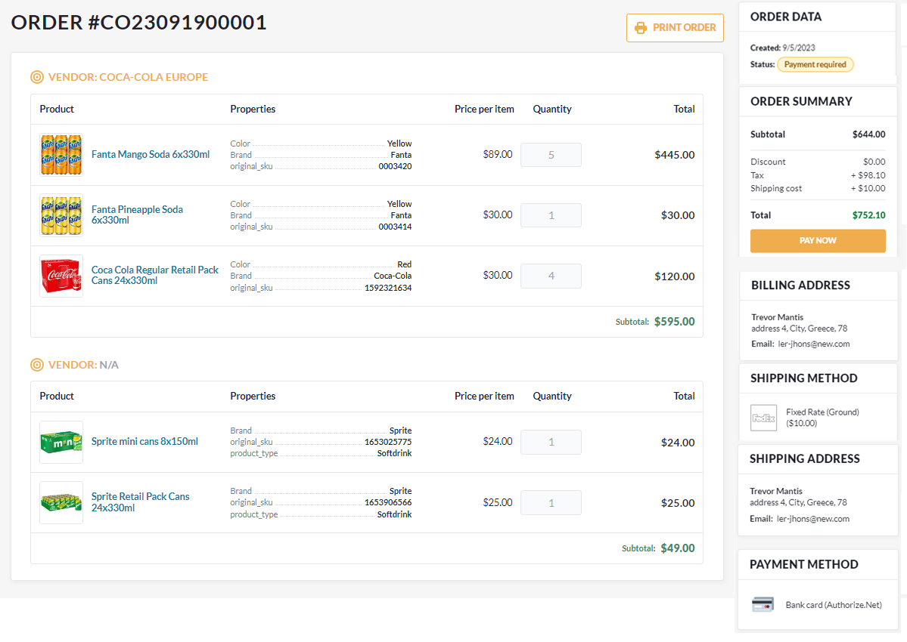
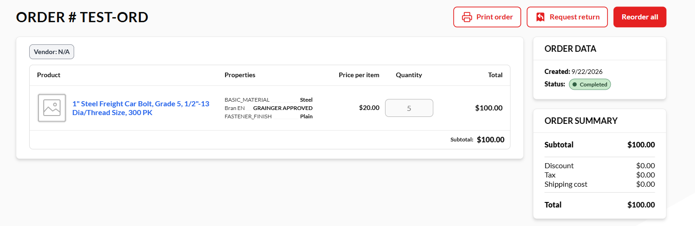
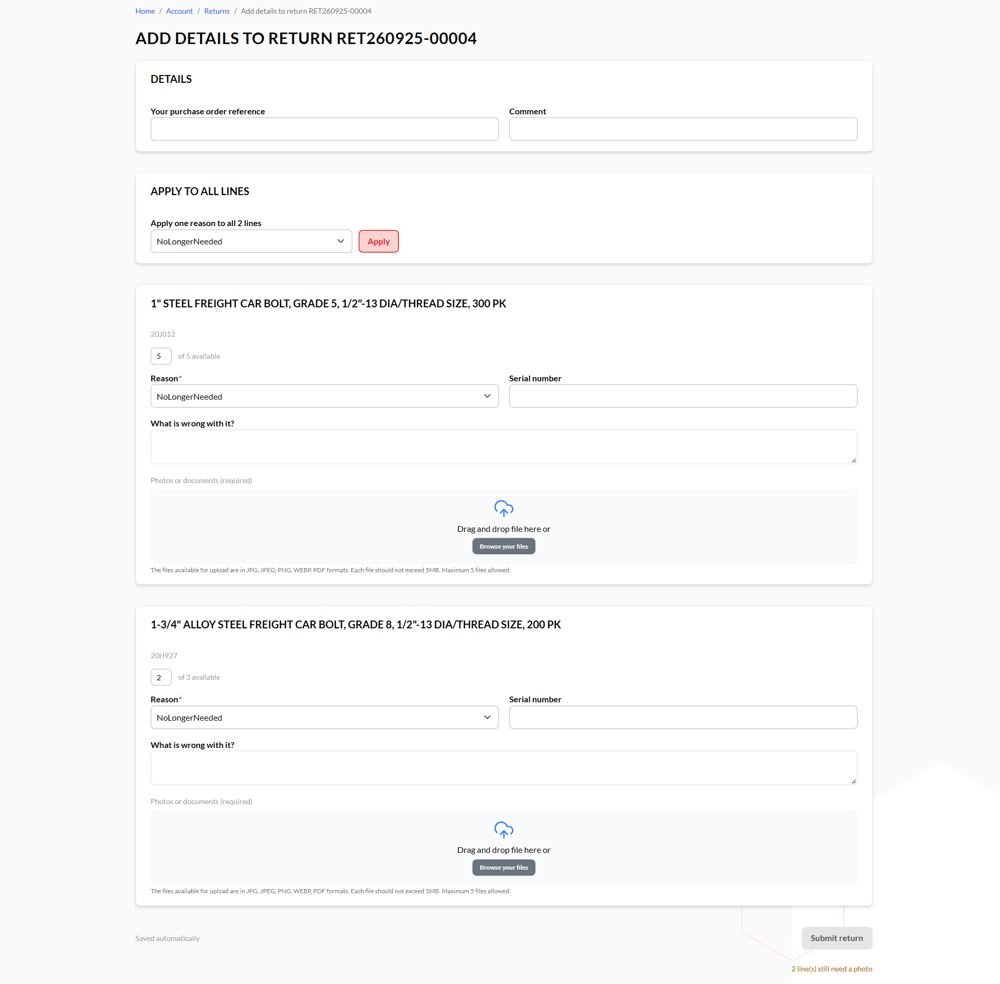

# Orders

The **Orders** section lists all the user's orders, including order number, invoice number, order date, current status, and total order amount.

Here you can:

* Switch between the **All orders** and **My orders** tabs to view all orders placed by a user or company (as an organization maintainer).
* Search for orders by keyword.
* Filter orders by status, date of creation, and date range.

    !!! note 
        In the left menu, you can immediately see all orders sorted by status, without having to apply any filters.  

* Sort orders by date, status, or total in ascending or descending order:

    

To view the order details, click the desired order in the orders list. The order details open in a new window:

Here you can:

* View the list of the ordered items grouped by vendor.
* View order totals and subtotals, including prices per item, shipping costs, taxes, etc.
* View shipping and billing details. 

    !!! note
        Shipping method and shipping address appear only for physical products.

* Print your order information.
* Pay for the order in case of **Payment required** status.
* Reorder all items from the completed orders:

    

## Return request

Once your order reaches the **Completed** status, you can request a return:

1. Click the **Request return** button that appears above the order details:

    {: style="display: block; margin: 0 auto;" }

1. Provide the following details:

    {: style="display: block; margin: 0 auto;" }

1. Click **Submit return**.

Created returns appear in the existing **Returns** list in the main menu. Each return can later be rejected, partially approved, or fully approved.
 
 
{: width="20"} [Configuring returns](/platform/user-guide/latest/order-management/managing-returns)

 
 
********

    <a href="../dashboard">← Dashboard</a>
    <a href="../lists">Lists →</a>

