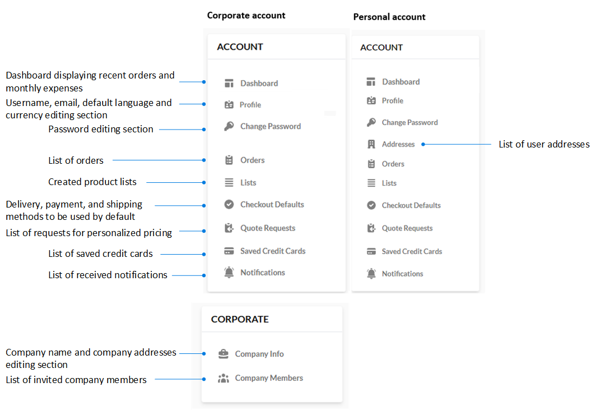

# Personal and Corporate Accounts

Our Storefront supports two different account categories: personal and corporate.

A personal account allows individuals to shop in their personal capacity. Conversely, a corporate account allows you to shop on behalf of a company, eliminating the need to provide personal addresses and instead using those associated with the company.

As a result, the menu for corporate accounts does not include an **Address** item, but rather an entire section dedicated to corporate information.

The illustration below contrasts these two account types:

