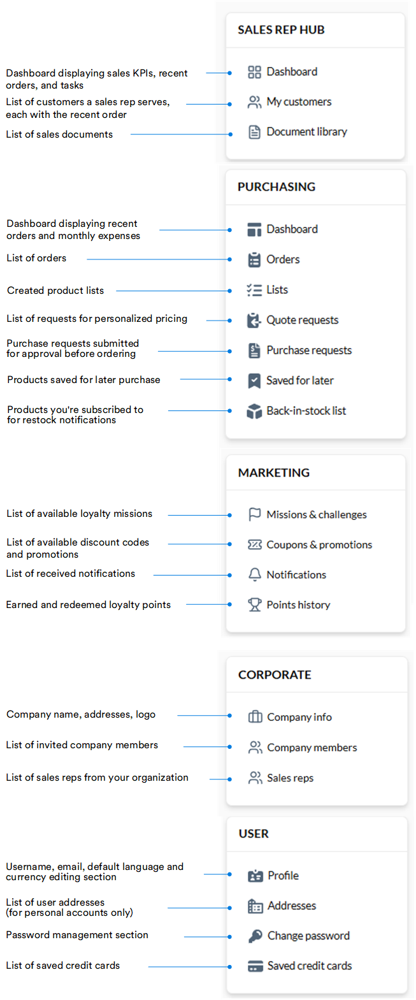

# Personal and Corporate Accounts

Our Frontend supports two different account categories: personal and corporate.

A personal account allows individuals to shop in their personal capacity. Conversely, a corporate account allows you to shop on behalf of a company, eliminating the need to provide personal addresses and instead using those associated with the company. Corporate account users can switch between multiple organizations:

Which items and sections appear depends on the account type and configuration:

* The **Addresses** item appears only in personal accounts.
* The **Corporate** section appears only in corporate accounts.
* The **Sales reps** item appears only when the Sales Rep feature is enabled in the Platform and the store uses it.
* The **Sales Rep Hub** section appears only for sales reps.

The image below shows the account menu:

{: style="display: block; margin: 0 auto;" }

 
 
********

    <a href="../../navigation/product-page-layout">← Product page layout</a>
    <a href="../sales-rep-hub">Sales Rep hub →</a>

