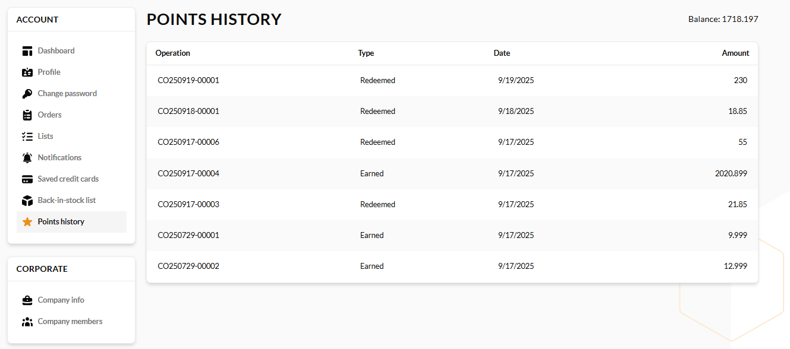

# Points History

If a seller uses loyalty programs to reward customers, buyers can view their accumulated loyalty points in the Points History section.

This section shows the number of points earned and redeemed for each order, as well as the total balance of points remaining:

 
 
********

    <a href="../purchase-requests">← Purchase requests</a>
    <a href="../company-info">Company info →</a>

