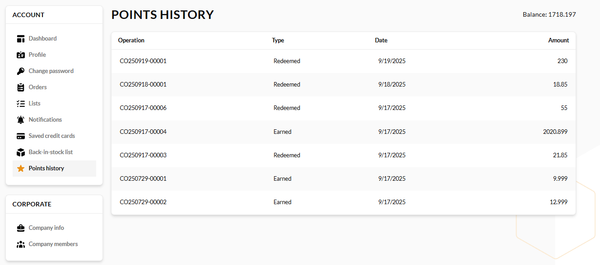

# Points History

If a seller uses loyalty programs to reward customers, buyers can view their accumulated loyalty points in the **Points history** section. For an individual-level loyalty mission, the points history table shows only the points earned by an individual user and available to that user. For an organization-level mission, it shows the points earned by any member of a company and available to all members of that company.

This section shows the number of points earned and redeemed for each order, as well as the total balance of points remaining:

 
 
********

    <a href="../notifications">← Notifications</a>
    <a href="../company-info">Company info →</a>

