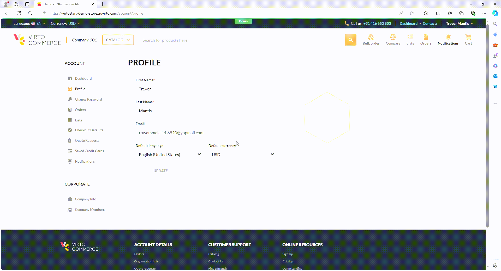

# Profile

In the **Profile** section, you can:

* Edit your name, last name, email.
* Change your password.
* Set a default currency from the dropdown list. The selected currency will be automatically applied to all the prices. 
* Set a default language from the dropdown list. The interface language will be automatically changed to the chosen one:

    

 
 
********

    <a href="../dashboard">← Dashboard</a>
    <a href="../change-password">Change password →</a>

