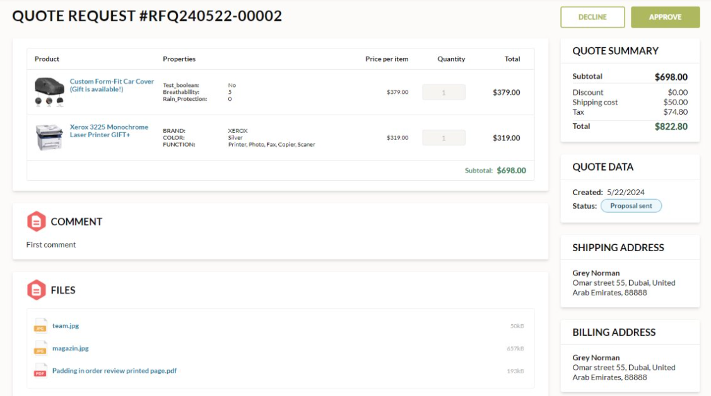

# Quote request

To request personalized pricing or align bulk orders with negotiated agreements, users can [create quote requests](../shopping/submit-quotes.md). The **Quote request** section lists all the quote requests created by the user:

Click on the desired quote request from the list to view its details, including:

* The list of requested products.
* Product properties, price per item, and requested quantities.
* Shipping address.
* Date of quote creation.

Click on a draft quote request to:

* Add remarks.
* Drag and drop files or browse additional files. The progress bar indicates when the upload is complete. 

    

    !!! note
        SCV, DOCX, JPG, PDF, PNG, TXT, XLSX formats are admissible. Each file should not exceed 10MB. Maximum 5 files are allowed. 

* Review the products list: edit quantities or delete items.
* Select shipping and billing addresses from the list or create new ones.
* Save changes for further editing.
* Submit the quote to the vendor.

