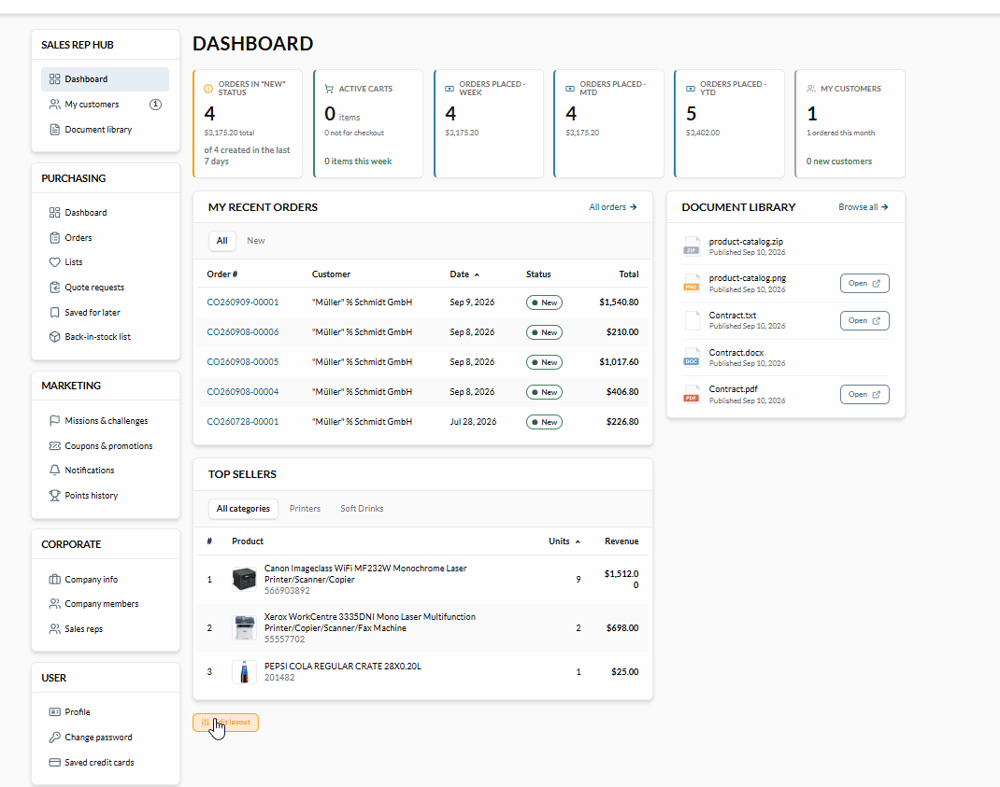
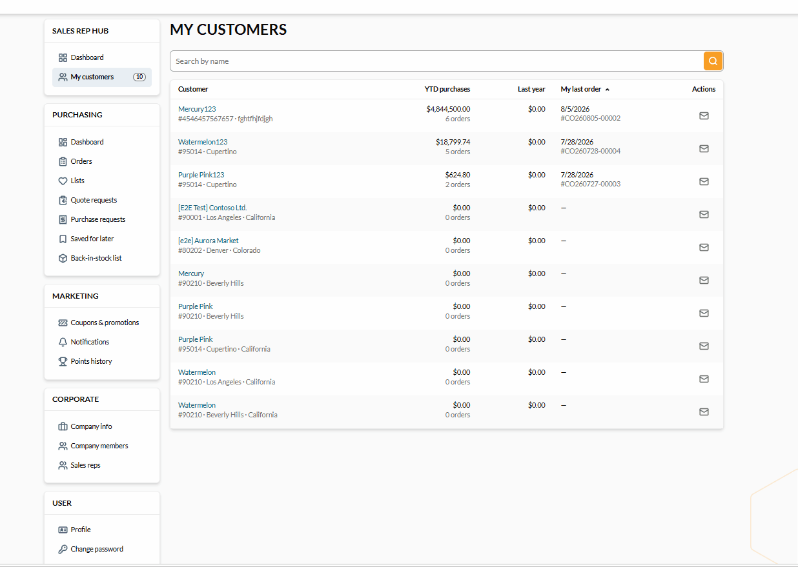
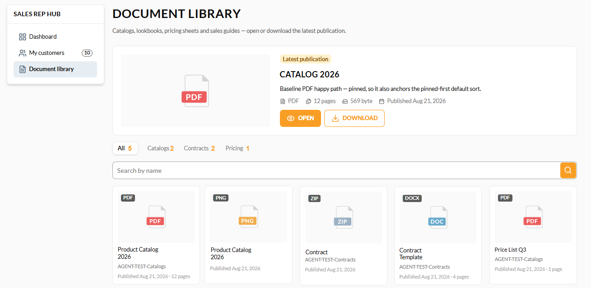

# Sales Rep Hub

The **Sales Rep Hub** is the workspace for sales representatives. It opens from the **Sales Rep Hub** section of the account menu and is available only to users who are sales reps. It gives a rep an overview of their assigned customers and orders, and access to shared sales materials.

## Dashboard

The **Dashboard** is the hub's landing page. It shows KPI cards summarizing the rep's activity, top selling products, and available documents: 

{: style="display: block; margin: 0 auto;" }

The dashboard can be edited as follows:

## My customers

The **My customers** page lists the customer organizations the rep is assigned to serve:

{: style="display: block; margin: 0 auto;" }

The customers can be edited as follows:

## Document library

The **Document library** page lists the sales materials that are available to the rep with advanced permissions, for example product images, brochures, and price sheets.

The rep can browse and search the list, then open or download any accessible document. Supported file types are JPEG, PNG, ZIP, PDF, WEBP, XLS, TXT, and DOC:

{: width="25"} [Uploading documents to the library](/platform/user-guide/latest/sales-rep/document-library)

 
 
********

    <a href="../overview">← Personal and corporate accounts</a>
    <a href="../dashboard">Dashboard →</a>

