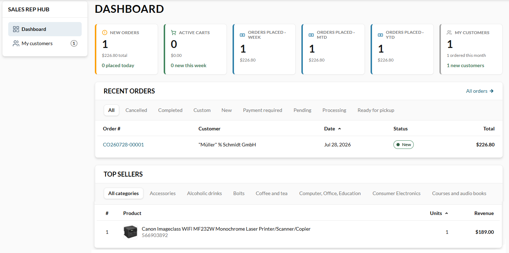
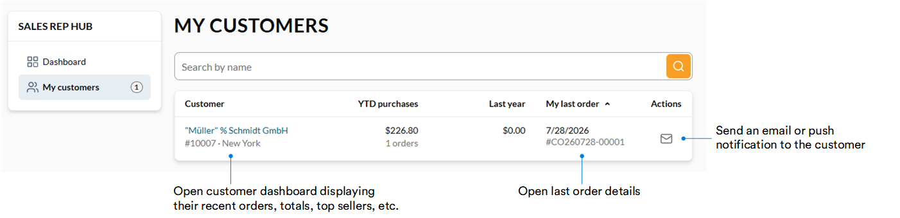

# Sales Rep Hub

The **Sales Rep Hub** is the workspace for sales representatives. It opens from the **Sales Rep Hub** section of the account menu and is available only to users who are sales reps. It gives a rep an overview of their assigned customers and orders.

## Dashboard

The **Dashboard** is the hub's landing page. It shows KPI cards summarizing the rep's activity: 

{: style="display: block; margin: 0 auto;" }

## My customers

The **My customers** page lists the customer organizations the rep is assigned to serve:

{: style="display: block; margin: 0 auto;" }

 
 
********

    <a href="../overview">← Personal and corporate accounts</a>
    <a href="../dashboard">Dashboard →</a>

