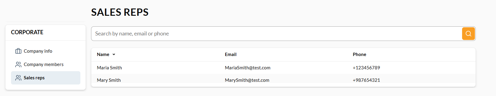

# Sales Reps

If you are signed in to a corporate account and are a member of an organization works with sales representatives, you can see who they are and how to reach them without contacting support. The Sales reps page lists everyone currently assigned to serve your company, with their name, email, and phone number.

If your company has no assigned sales reps yet, the page still opens but shows no results.

The Sales reps page always reflects your currently active organization. Switch between your companies to view corresponding sales reps.

If you think the wrong person is listed, contact your provider's support team. This page is read-only contact information.

{: width="25"} [Managing sales reps](/platform/user-guide/latest/sales-rep/managing-sales-reps)

 
 
********

    <a href="../company-members">← Company members</a>
    <a href="../profile">User profile →</a>

