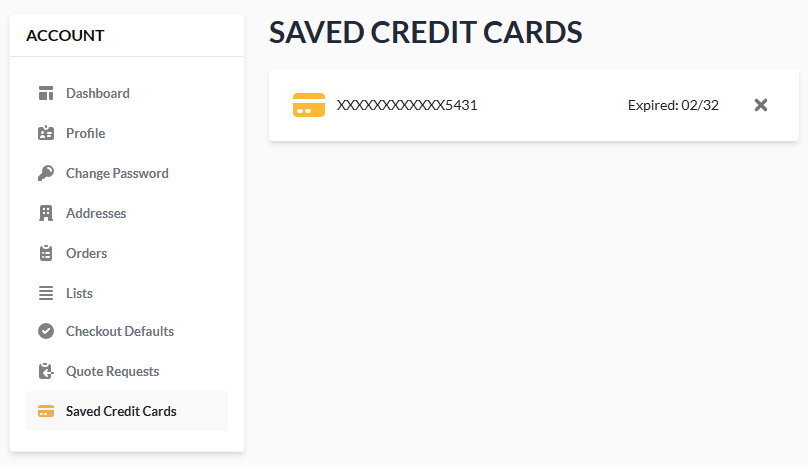

# Saved Credit Cards

In the **Saved Credit Cards** section, you can:

* View the list of the saved cards to be selected from the dropdown list when [paying for orders](../shopping/checkout-process.md).
* Delete cards from the list.

 
 
********

    <a href="../quote-requests">← Quote requests</a>
    <a href="../notifications">Notifications →</a>

