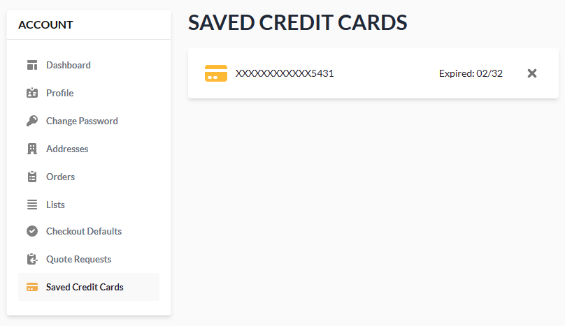

# Saved Credit Cards

In the **Saved credit cards** section, you can:

* View the list of the saved cards to be selected from the dropdown list when [paying for orders](../shopping/checkout-process.md).
* Delete cards from the list.

{: style="display: block; margin: 0 auto;" width="600"}

 
 
********

    <a href="../addresses">← Addresses</a>
    <a href="../../shopping/products-purchase-options">Options for buying products →</a>

