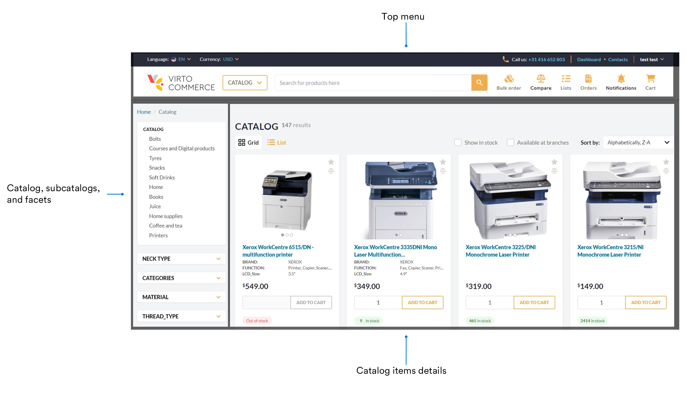
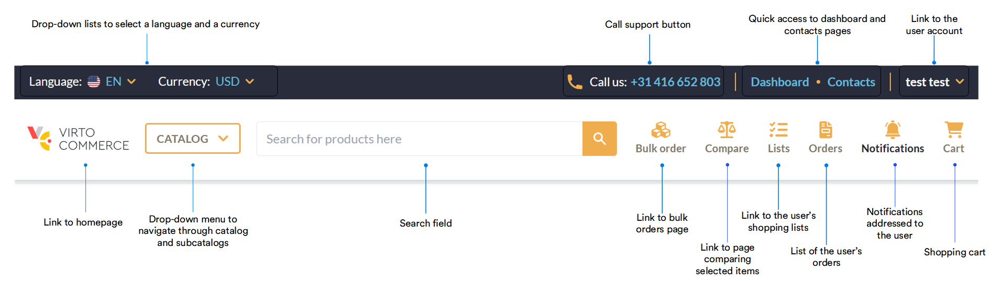
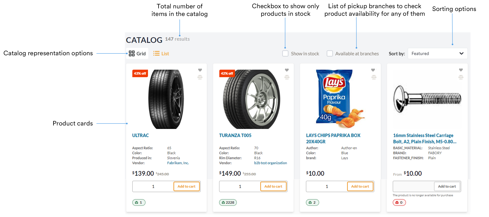
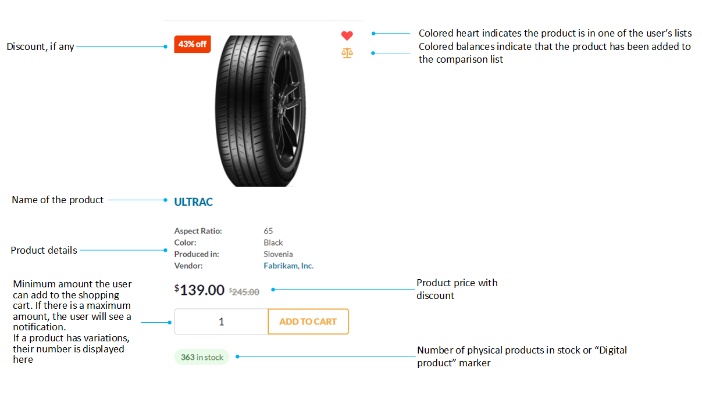
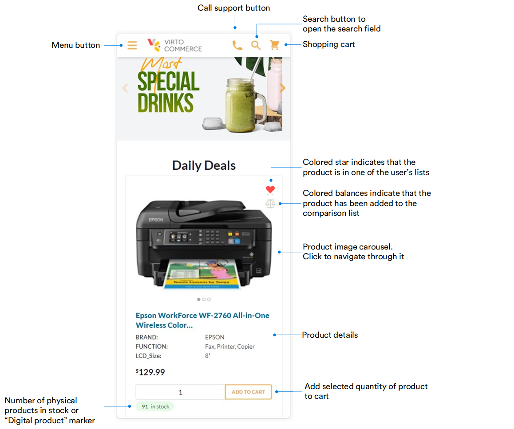
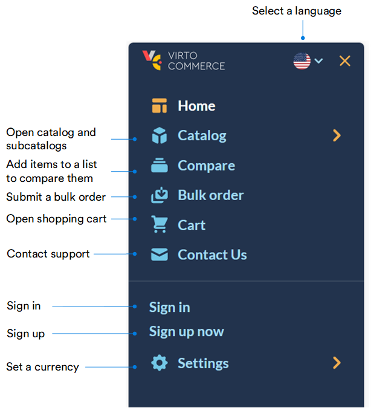

# Homepage Layout

The homepage can be visually divided into 3 parts:

* [Top menu.](homepage-layout.md#top-menu)
* [Catalogs, subcatalogs, and facets.](homepage-layout.md#catalogs-subcatalogs-facets)
* [Catalog items details.](homepage-layout.md#catalog-items-details)

## Top menu

From the top menu, you can:

* Access your account profile.
* Select language and currency to display prices in.
* Search for products by their name or SKU, and more.

{: width="25"} [Bulk orders](../shopping/bulk-orders.md)

{: width="25"} [Comparing products](../shopping/compare-products.md)

## Catalogs, subcatalogs, facets

From the left side menu, you can:

* Quickly navigate to the required subcatalog.
* Narrow down the number of items displayed by specifying the required product characteristics in the facets.

{: width="25"} [Search options](../shopping/searching-for-products.md)

## Catalog items details

In this area, you can:

* Switch between grid view and list view of the catalog items.
* Check the availability of the products in the selected branches.
* Sort products by price or name.
* View product details, etc.

Each product card displays:

* Product name and its basic characteristics.
* Its quantity in stock.
* Discounts applied, etc. 

## Mobile version

In the Frontend Application mobile version, the core principles and functionality remain consistent with the desktop version. Users may notice differences in the layout on their mobile devices, tailored to enhance usability and navigation on smaller screens.

### Homepage

{: width="900"}

### Menu

{: width="500"}

 
 
********

    <a href="../../registration_and_signing_in/create-account">← Registration and signing in</a>
    <a href="../product-page-layout">Product page layout →</a>

