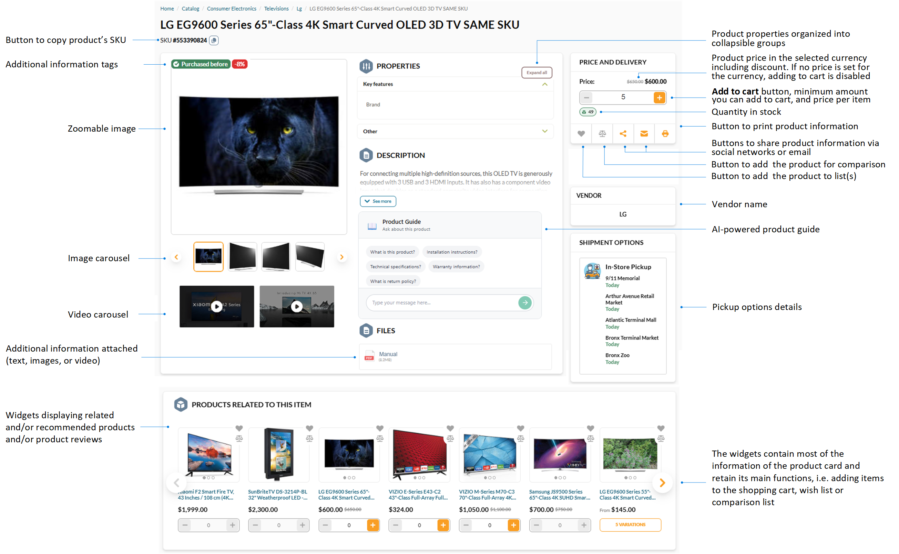
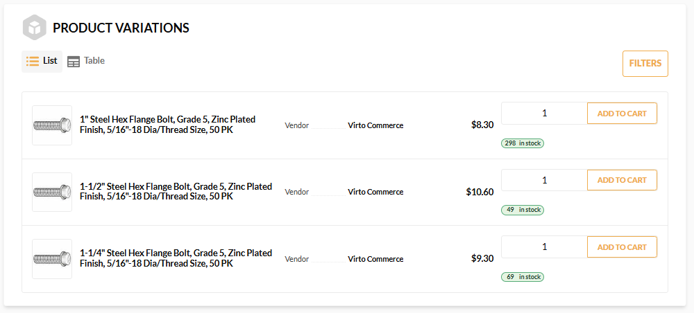
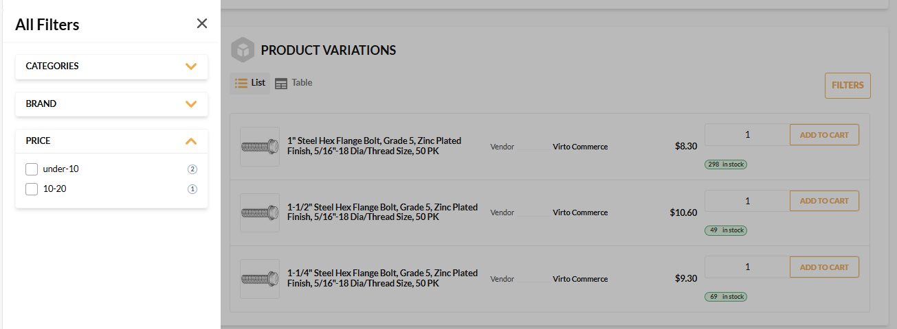
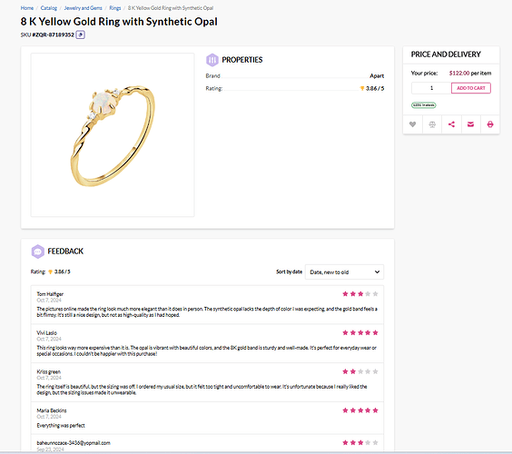

# Product Page Layout

Product pages display:

* Product name and description.
* Quantity in stock (for physical products).
* Discounts and price per item.
* Images and videos.
* Related products.
* Product variations.

From the product page, you can:

* Add the desired amount of products to your cart.
* Add products to the comparison or user's list.
* Navigate to [Brands page](brands-page.md) by clicking the product brand specified as the product property.   
* Download attached files.
* Print the product description.
* Share product information via social networks or email. 

If a product has variations, they are displayed in a separate widget as a list or as a table:

{: style="display: block; margin: 0 auto;" width="750"}

Click **Filters** to narrow down the selection of variations:

{: style="display: block; margin: 0 auto;" width="750"}

If a [reviews option is enabled](/platform/user-guide/latest/rating-reviews/managing-reviews#enable-product-reviews) for the Frontend Application, the reviews are displayed below the product description:

{: style="display: block; margin: 0 auto;" }

 
 
********

    <a href="../homepage-layout">← Homepage layout</a>
    <a href="../brands-page">Brands page →</a>

