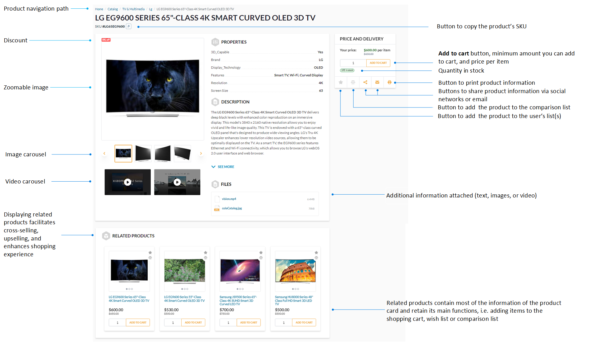

# Product page layout

Product pages display:

* Product name and description.
* Quantity in stock (for physical products).
* Discounts and price per item.

From the product page, you can:

* Add the desired amount of products to your cart.
* Print the product description.
* Share product information via social networks or email. 

