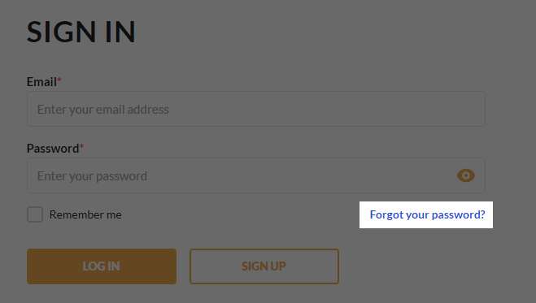
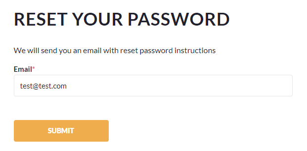
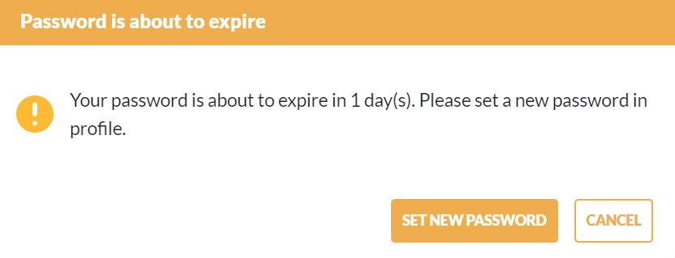
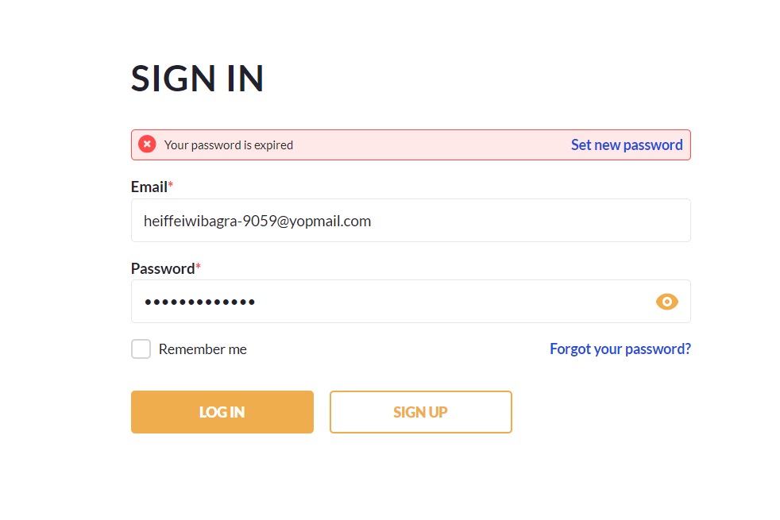
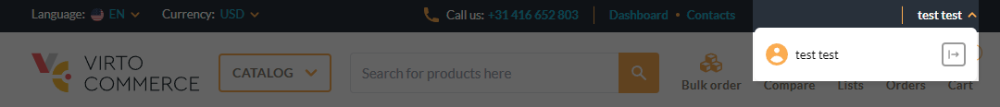
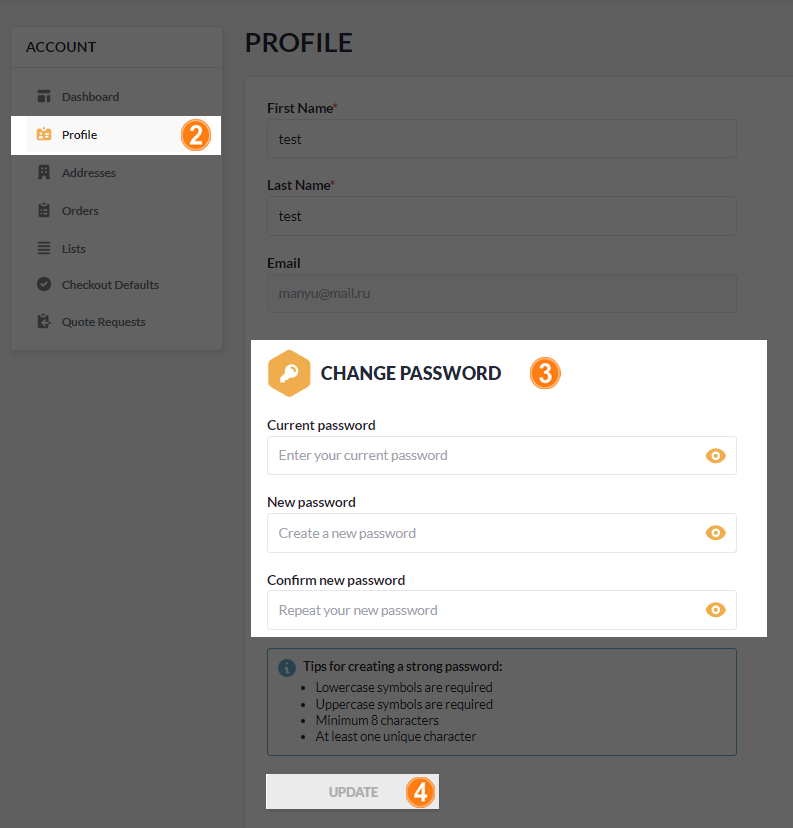

# Password Management

Managing password includes:

* [Resetting password.](password-management.md#restore-password)
* [Changing password.](password-management.md#update-password)

## Reset password

If you forgot your password, you can reset it as follows:

1. Click **Forgot your password?** in the sign in form:

    {: width="500"}

1. Enter your email to send the reset password instructions to.

    {: width="400"}

1. Click on the link in the email and follow further insctructions.

You new password has been created.

## Change password

Changing password on a regular basis enhances the protection of user accounts. It significantly reduces the opportunity for attackers to exploit a compromised password. 

You should change your password:

* At any time you consider it is necessary.
* At the request of administrators if they believe your password is compromised. 
* At regular intervals set by the system. In this case, users are notified of the impending expiration:

    {: width="500"}

    If the password has expired, the user will be prompted to set a new password when logging in:

    {: width="900"}

To change the password:

1. Click on the user name in the top right corner. In the dropdown, click on the user name again.

    

1. In the left side of the account profile, click **Profile**.
1. Change the password.
1. Click **UPDATE**.

    {: width="500"}

You password has been successfully changed.
