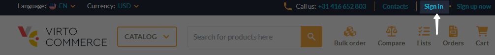
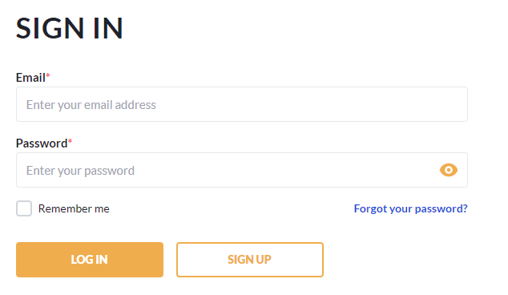
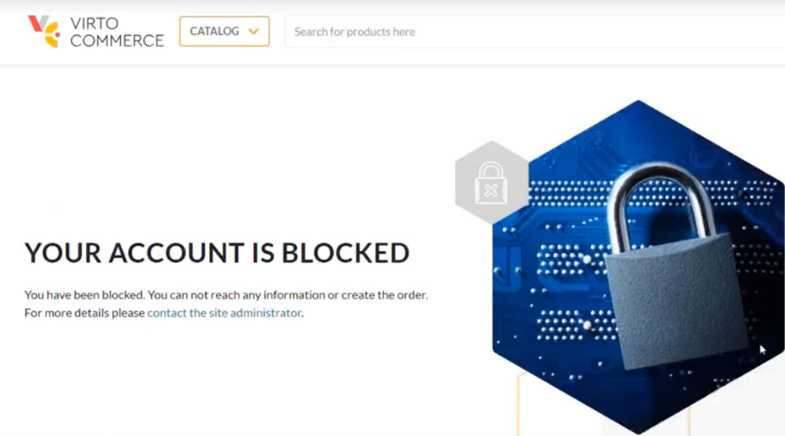

# Sign In

To sign in into the account:

1. Open the Frontend Application and click **Sign in** in the top right corner.

    

1. Enter you email and password:

    {: width="500"}

    !!! note
        Check **Remember me** to save your credentials.

1. Click **Log in**.

You can now use the Frontend Application as a registered user. 

!!! note
    In some cases, users may see the following screen when trying to log in. 

    {: width="500"}

    If this happens, contact the site administrator.

 
 
********

    <a href="../create-account">← Create account</a>
    <a href="../password-management">Password management →</a>

