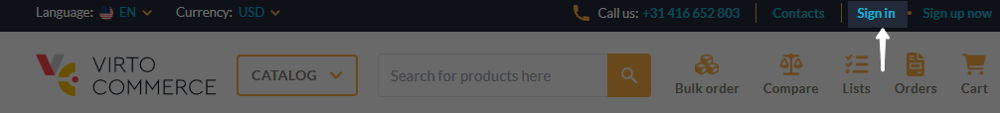
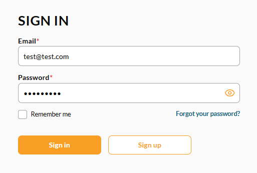
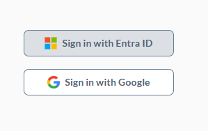
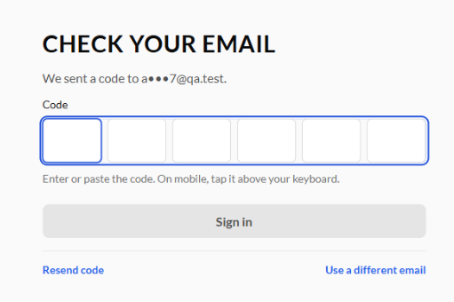
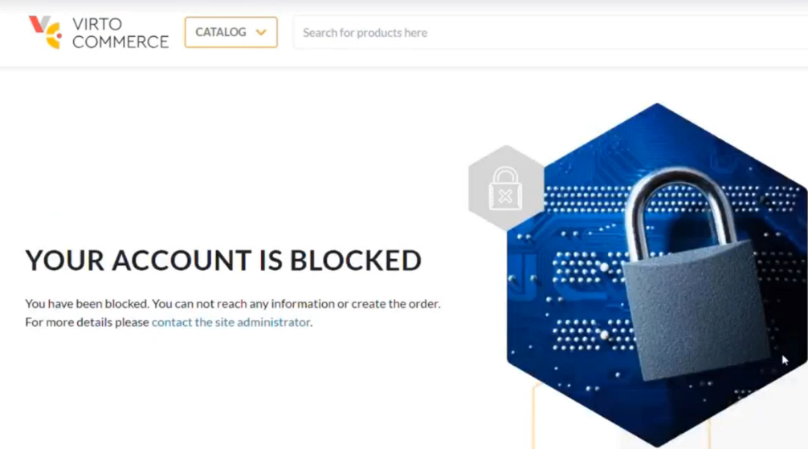

# Sign In

To sign in into the account:

1. Open the Frontend and click **Sign in** in the top right corner.

    {: style="display: block; margin: 0 auto;" }

1. Use either sign-in option:

    1. Sign in with your email and password:

        {: style="display: block; margin: 0 auto;" width="500"}

        !!! note
            Check **Remember me** to save your credentials.

    1. Sign in with Entra Id or Google:

        {: style="display: block; margin: 0 auto;" }

    1.  Sign in with a one-time code sent to your email:

        {: style="display: block; margin: 0 auto;" width="500"}

1. Click **Sign in**.

You can now use the Frontend as a registered user. 

!!! note
    Contact the site administrator if you see the following screen when you try to sign in: 

    {: style="display: block; margin: 0 auto;" width="500"}

 
 
********

    <a href="../create-account">← Create account</a>
    <a href="../password-management">Password management →</a>

