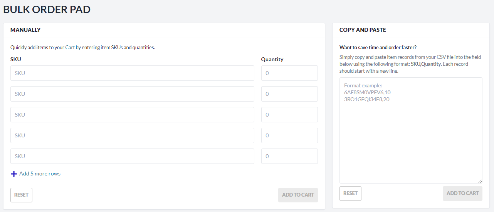
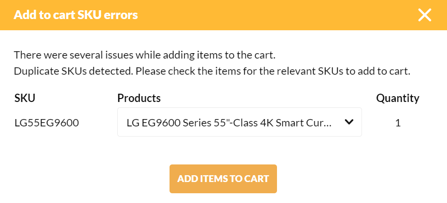

# Bulk orders

The **Bulk orders** function allows users to place orders for a large quantity of products or multiple items at once.

To place a bulk order:

1. Click **Bulk order** in the top menu.

    

1. In the **Bulk order pad**, you can enter products SKUs and quantities:
    * Manually, one by one.
    * By copying and pasting them from your SCV file using the following format: SKU,Quantity.

    

1. Click **Add to cart**.

!!! note
    Similar product SKUs might belong to different products from different catalogs. If duplicate SKUs are detected, you will receive a notification and be prompted to select the intended product from a dropdown list.
    {: width="600"}

Now you can proceed to [Checkout.](checkout-process.md)