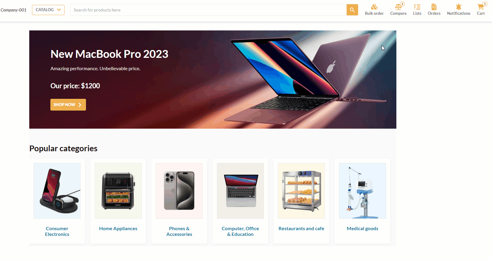

# Bulk Orders

The **Bulk orders** function allows users to place orders for a large quantity of products or multiple items at once. 

Click **Bulk order** on the top menu:

The **Bulk order** pad opens. You will see the following placement options:

* From file.
* By copy-pasting.
* Manually.

=== "From file"

    Intelligent document processing allows you to upload printed or handwritten files containing order details. It not only recognizes and extracts text from documents, but also understands the context and meaning of the information. To place your bulk order from file:

    1. In the **Bulk order** pad, click on the **From file** tab.
    1. Drag and drop or browse your file containing order details.

    In a few seconds, the file will be properly recognized, the products will be found in the catalog, and their correct quantities will be added to the order:

    

=== "Copy and paste"

    To copy and paste your order details:

    1. In the **Bulk order** pad, click on the **Copy & paste** tab.
    1. Сopy and paste item records from your CSV file into the field using the following format: **SKU,Quantity**. Each record should start with a new line:

    

    !!! note
        Similar product SKUs might belong to different products from different catalogs. If duplicate SKUs are detected, you will receive a notification and be prompted to select the intended product from a dropdown list.
        {: width="600"}

=== "Manually"

    1. In the **Bulk order pad**, click on the **Manually** tab:
    1. Enter SKUs and quantities of the items you want to order:

    

    !!! note
        Similar product SKUs might belong to different products from different catalogs. If duplicate SKUs are detected, you will receive a notification and be prompted to select the intended product from a dropdown list.
        {: width="600"}

Now you can [add products to cart](products-purchase-options.md) or [request a quote](submit-quotes.md).