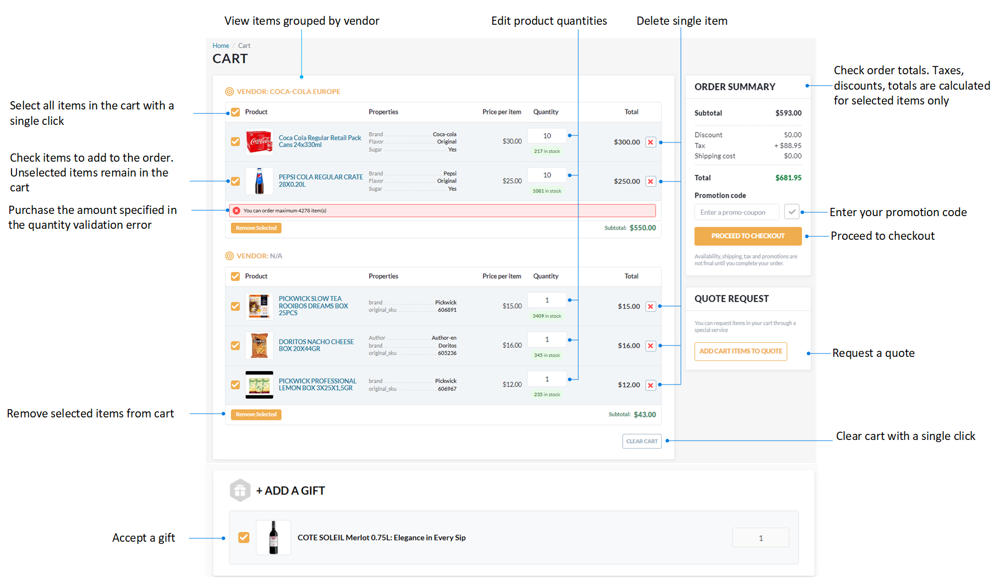
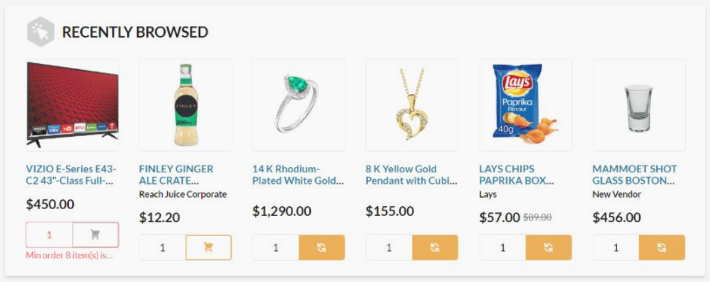
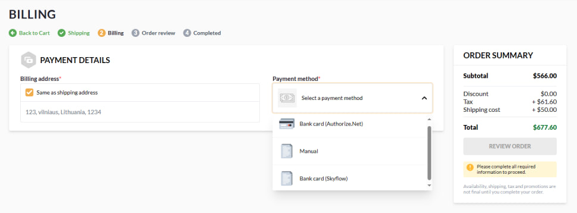
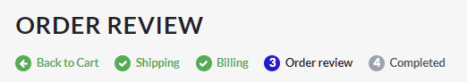
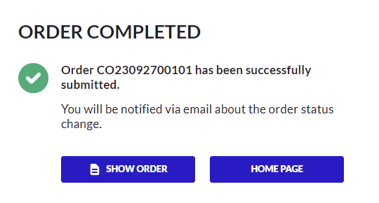

# Checkout

Checkout is the final stage of the online shopping process where customers provide payment and shipping information, review their order, and confirm the purchase. 

To complete your order:

1. Click **Cart** in the top menu to open the cart details:

    

    Here you can:
    
    * View the items you have ordered grouped by vendor.
    * Change the quantity of items ordered.
    * Delete items in bulk or individually.
    * Check items in bulk and individually.
    * Request for a quote.
    * Clear the cart.
    * View the gifts you can receive as part of a loyalty program. The gifts appear automatically and are preselected.
    * Apply a promotion code.
    * Proceed to checkout.

    

    The cart page may also show recently browsed products if this [feature is enabled](../../../../platform/user-guide/recommend/overview#get-started).

    {: width="850"}

1. Click **Proceed to checkout**.

    !!! note
        The checkout process for carts containing only digital products does not include the **Shipping** step since digital products do not require shipping.

1. Select a delivery option:

    === "Pickup"

        Select a pickup point from the list if you do not require delivery and provide your comments, if any.
         
         
        {: width="25"} [Managing pickup locations](../../../../platform/user-guide/shipping/managing-shipping-methods#add-or-edit-pickup-location)
         
         
        

    === "Shipping"

        * Select a shipping address if you need you order to be delivered to your address.

            !!! note
                If [Shipping address policy](../../../../platform/user-guide/store/settings#general-settings) is enabled in the Platform, you will see a prefilled shipping address on the Shipping page.

        * Select a delivery method from the dropdown list: **Ground** or **Air**. The shipping cost appears in the order summary.
        * Enter your comments, if any.

        

1. Click **Proceed to billing** to proceed to the next step.

1. Specify payment details:
    * Select a shipping address from the list, add new one, or check **Same as shipping address**. 
    * Select a payment method from the dropdown list:

        === "Bank card (Authorize.Net)"
        
            **Authorize.net** adds the **Payment** step to the checkout process. It does not appear if you choose to pay manually.

        === "Bank card (Skyflow)" 
        
            **SkyFlow** adds the **Payment** step to the checkout process. It does not appear if you choose to pay manually. It allows you to save credit cards for further payments and select previously saved cards from the dropdown list.

        === "Bank card (CyberSource)"

            **CyberSource**  adds the **Payment** step to the checkout process. It does not appear if you choose to pay manually. It allows you to save credit cards for further payments and select previously saved cards from the dropdown list.

        === "Manual"
        
            **Manual payment** allows you to pay for the order later.
 
 
    {: style="display: block; margin: 0 auto;" width="700"}

1. Click **Review order** to review your order details. You can not edit your information here, but you can return to any of the previous steps by clicking them in the navigation path menu:
 
 
    {: style="display: block; margin: 0 auto;" width="400"}
 
 
    This step activates the **Print order** button:
 
 
    {: style="display: block; margin: 0 auto;" width="700"}

1. Click **Place order**. Depending on your choice in step 5, you will either be notified that the order has been successfully placed (manual payment. Last step of this instruction) or you will be offered to pay for the order (bank card payment). Fill in the bank card details, then click **Pay now**. 

    !!! note 
        In case of the Skyflow or CyberSource option, you can save card for future payments, and then select a previously saved card from the dropdown list. You can view your saved cards at **Account --> Saved credit cards**.

        {: width="25"} [Saved credit cards](../account/saved-credit-cards.md) 

    

1. Your order has been successfully placed:

    {: style="display: block; margin: 0 auto;" width="400"}

You can view your orders at **Account --> Orders**.
 
 
{: width="25"} [Viewing orders](../account/orders.md)

 
 
********

    <a href="../notifications">← Notifications</a>

