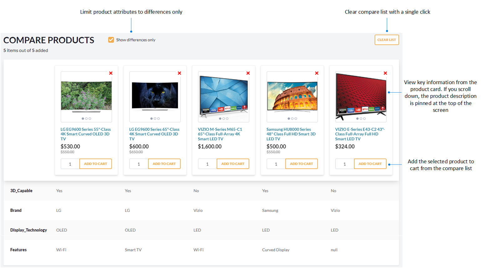

# Compare Products

To make informed purchasing decisions, you can directly compare multiple products or items side by side. Customers can select multiple products they are interested in and see a detailed, side-by-side comparison of their specifications, features, and attributes. 

To add a product to the compare list:

1. Click {: width="20"} in the top right corner of the product card. The notification of successful addition to the compare list appears.

    !!! Note
        Only 5 products can be compared at a time.

1. Click **Compare** in the popup notification or in the top menu to open the compare list.

    

1. Within the compare list, you can:
    * Review all product characteristics.
    * Limit the list of product characteristics to differences only.
    * Add selected products to cart.
    * Clear the compare list with a single click.

    

 
 
********

    <a href="../bulk-orders">← Bulk orders</a>
    <a href="../lists">Products lists →</a>

