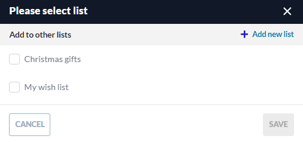

# Products Lists

To add a product to a list:

1. Click {: width="20"} in the top right corner of the product card. 
1. In the popup window, select the list you want to add the product to or create a new list by clicking **Add new list** in the top right corner.

    

1. Click **Save** to save the changes.

The notification of successful addition to the selected list appears. 

{: width="25"}  [Managing product lists](../account/lists.md)

 
 
********

    <a href="../compare-products">← Products comparison</a>
    <a href="../submit-quotes">Quotes submission →</a>

