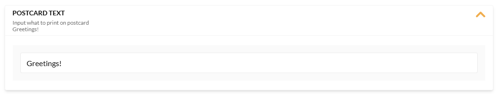

# Options for Buying Products

In our Frontend Application, buyers have the following options to purchase products:  

* **Quick purchase from the product list**: Users add products to their carts directly from the catalog by clicking on the **Add to cart** button:

    

* **Choose from product variations**: Users select the specific variation of a product that best fits their requirements, such as size or color, by clicking on the **Variations** button: 

    

* **Customize products to your needs**: Users adapt products to their preferences by configuring available options, such as selecting decorations for a cake or features for a bike, by clicking on the **Customize** button:

    

    Some options are required, i.e. users must select one of the available options when configuring the product:

    {: style="display: block; margin: 0 auto;" }

    A **None** option allows users to skip selecting an option for that section when configuring their product:

    {: style="display: block; margin: 0 auto;" }

    In the text message widget, users can enter custom text while personalizing their products. This can be used for messages on postcards, engravings on rings, greetings on cakes, and more:

    {: style="display: block; margin: 0 auto;" }

    Users can also upload files for further customization. This feature can be used to print a logo on the ordered product:

    {: style="display: block; margin: 0 auto;" }

    After the product is added to cart, it remains editable:

    {: style="display: block; margin: 0 auto;" }

 
 
********

    <a href="../../account/company-members">← Company members</a>
    <a href="../searching-for-products">Search options →</a>

