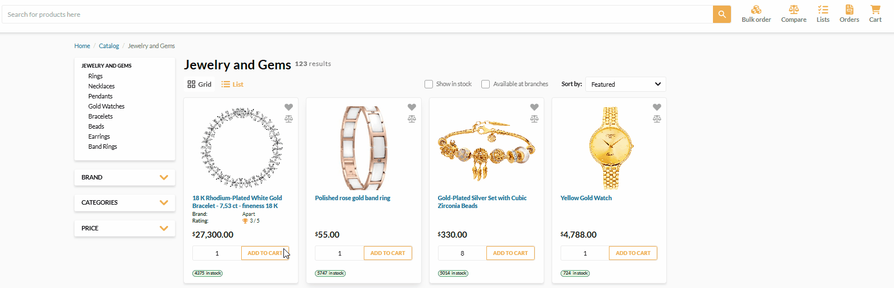
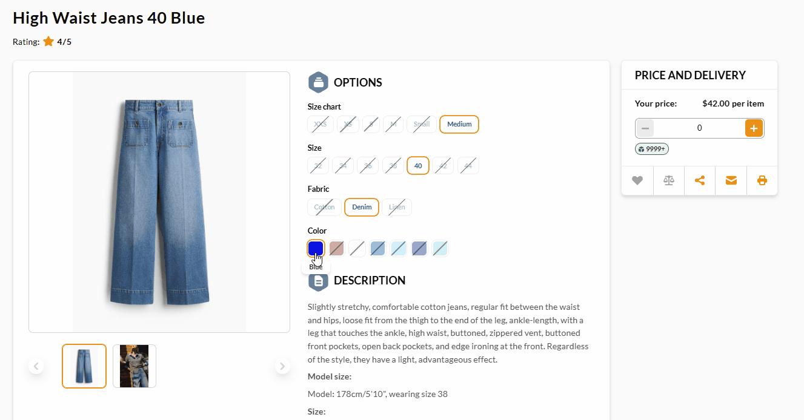
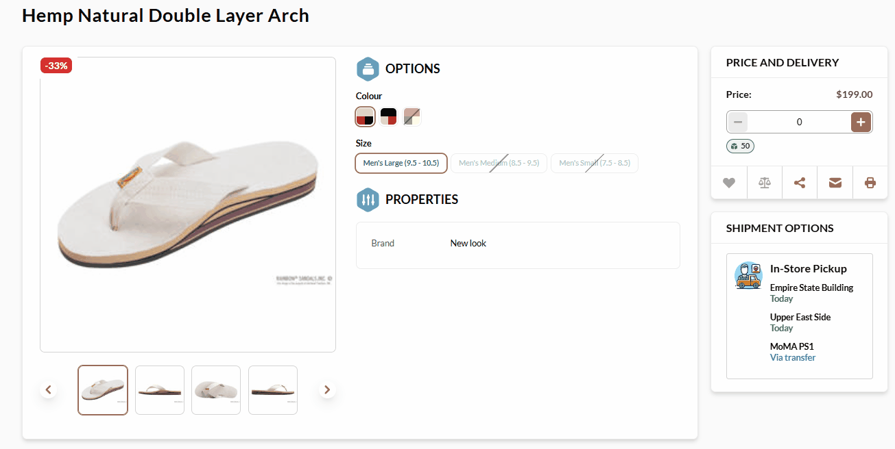

# Options for Buying Products

In our Frontend Application, buyers have the following options to purchase products:  

* [Quick purchase from the product list.](#purchase-from-product-list)
* [Choosing the required product variation.](#choose-from-product-variations)
* [Customizing products.](#configure-products)
* [Buying products from the the loyalty catalog.](#buy-products-from-loyalty-catalog)

## Purchase from product list

Users add products to their carts directly from the catalog by clicking on the **Add to cart** button:

## Choose from product variations

Users select the specific variation of a product that best fits their requirements, such as size or color, by clicking on the **Variations** button. In the list view, users do not need to open a product card - all of the product’s options can be expanded directly beneath it on the same page:

  
  

    <iframe loading="lazy" class="sl-demo" src="https://virtocommerce.storylane.io/demo/pot8fs7qg7ke?embed=inline" name="sl-embed" allow="fullscreen" allowfullscreen style="position:absolute;top:0;left:0;width:100%!important;height:100%!important;border:1px solid rgba(63,95,172,0.35);box-shadow: 0px 0px 18px rgba(26, 19, 72, 0.15);border-radius:10px;box-sizing:border-box;"></iframe>
  

Customers can click on individual option values (e.g., color, size, material) to configure their desired product. Once a customer selects an option, the remaining options are refreshed to reflect what’s available based on that selection. Unavailable combinations are visibly disabled. When only one value is available for a specific option, it is automatically selected:

For products available in multiple colors, the frontend provides a multicolor selector that lets customers choose a complete color set rather than a single color variant. The remaining options are refreshed to reflect what’s available based on that selection: 

## Configure products

Users adapt products to their preferences by configuring available options, such as selecting decorations for a cake or features for a bike, by clicking on the **Customize** button. Below are some basic features:

* Some options are required, i.e. users must select one of the available options when configuring the product. 
* A **None** option allows users to skip selecting an option for that section when configuring their product.
* Some options are set as default. This provides a clear starting point for selections.
* In the text message widget, users can either enter custom text or select from predefined options while personalizing their products. This can be used for messages on postcards, engravings on rings, greetings on cakes, and more. 
* Users can also upload files for further customization. This feature can be used to print a logo on the ordered product.
* Products configurations can be [compared](compare-products.md) with each other or with other products. 
* After the product is added to cart, it remains editable:

  
 <iframe loading="lazy" class="sl-demo" src="https://virtocommerce.storylane.io/demo/lcuk7k9sukin?embed=inline" name="sl-embed" allow="fullscreen" allowfullscreen style="position:absolute;top:0;left:0;width:100%!important;height:100%!important;border:1px solid rgba(63,95,172,0.35);box-shadow: 0px 0px 18px rgba(26, 19, 72, 0.15);border-radius:10px;box-sizing:border-box;"></iframe> 
 

## Buy products from loyalty catalog

If your store runs a loyalty program, you can buy products with the points you have earned. You can find such products at **<storefront>/loyalty-catalog**. You can put them in the same cart as products you pay for with money. The cart keeps these two apart, showing a separate total for your money items and your points items, so it is always clear what each one costs.

  
  

    <iframe loading="lazy" class="sl-demo" src="https://app.storylane.io/demo/bx2gh1kcevb4?embed=inline" name="sl-embed" allow="fullscreen" allowfullscreen style="position:absolute;top:0;left:0;width:100%!important;height:100%!important;border:1px solid rgba(63,95,172,0.35);box-shadow: 0px 0px 18px rgba(26, 19, 72, 0.15);border-radius:10px;box-sizing:border-box;"></iframe>
  

{: width="25"} [Setting up loyalty catalog browsing](/platform/user-guide/latest/loyalty/set-up-loyalty-catalog-browsing)

 
 
********

    <a href="../../account/company-members">← Company members</a>
    <a href="../searching-for-products">Search options →</a>

