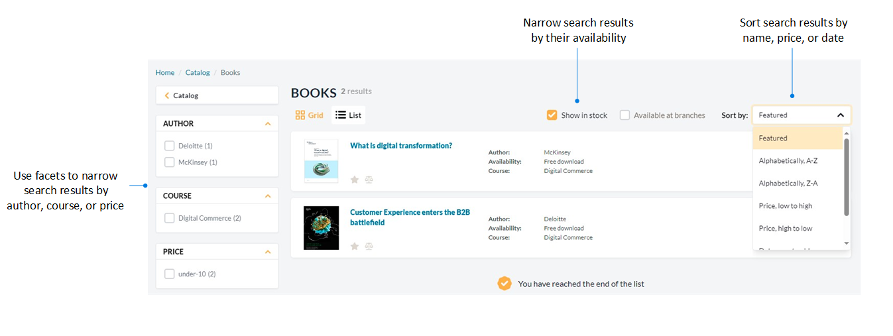

# Search Options

The Frontend Application provides the following ways to find products:

* [Text-based search](#text-based-search), including [scoped search.](#scoped-hierarchical-search) 
* [Barcode scanning.](#barcode-scanner)

## Text-based search

Enter keywords, SKU numbers, or other product attributes in the search bar. Use filters (facets) such as category, brand, price, and availability to refine results. 

For example, when searching for books, you can narrow your selection by author, course, or price. For additional precision, you can filter results based on product availability, indicated by the **Show in stock** checkbox. Search results can be sorted:

* Alphabetically.
* By price.
* By date.
    
{: style="display: block; margin: 0 auto;" }

Clicking the search input field opens a dropdown that displays the user's 5 most recent search queries:

{: style="display: block; margin: 0 auto;" }

### Scoped (hierarchical) search

Users can perform scoped searches within specific product categories. This narrows their search to a selected category, improving result relevance. A category chip appears in the search bar to indicate the current scope, and users can easily reset the search to span the entire catalog:

  
  

    <iframe loading="lazy" class="sl-demo" src="https://virtocommerce.storylane.io/demo/x6jbvtndrksq?embed=inline" name="sl-embed" allow="fullscreen" allowfullscreen style="position:absolute;top:0;left:0;width:100%!important;height:100%!important;border:1px solid rgba(63,95,172,0.35);box-shadow: 0px 0px 18px rgba(26, 19, 72, 0.15);border-radius:10px;box-sizing:border-box;"></iframe>
  

## Barcode scanner

A barcode scanner allows customers and sales representatives to quickly find products in the catalog using their mobile phones. Instead of manually searching, users can scan a product’s barcode with their phone’s camera to instantly open the product page.
The barcode scanner provides immediate access to product details, inventory levels, and pricing. This feature helps streamline inventory management, update product information, and speed up order fulfillment:

??? "Understanding barcodes"
    Barcodes are machine-readable symbols consisting of lines, spaces, characters, and digits. They are used to identify and track products throughout various stages of the supply chain. Common applications include inventory tracking in fulfillment centers, aiding accounting processes on invoices, and facilitating purchases in retail stores.

    Many industries and businesses integrate barcodes into their workflows due to their numerous advantages:

    * **Accurate inventory tracking**: Barcodes provide more reliable data than manual entry, helping track inventory, pricing, and product details such as expiration dates or weight. This ensures accurate stock levels and reduces errors in inventory management.

    * **Real-time data**: Barcode scanning provides instant access to product information, eliminating the need for manual data entry or retrieval. This allows businesses to quickly locate items in databases or online marketplaces.

    * **Ease of use**: Barcode scanners are simple to operate and require minimal training, making them an efficient tool in fulfillment centers and retail environments.

    * **Global acceptance**: Barcodes are widely used across industries and recognized worldwide, making them a universal tool for tracking and managing products in various business sectors.

    The most commonly used barcode types include:

    | **Barcode Type** | **Structure**  | **Capacity**              | **Usage** |
    |-----------------|--------------|----------------------|-------------------------------------------------------------|
    | **UPC-A**   | GTIN-12   | 12 digits            | Commonly used on retail products in North America. |
    | **UPC-E**   | GTIN-12   | 12 digits            | Suitable for small packages or retail products such as cosmetics, packs of chewing gum, and cigarettes in North America. |
    | **EAN-13**  | GTIN-13   | 13 digits            | Primarily used for retail products such as periodicals, magazines, and books outside of North America. |
    | **EAN-8**   | GTIN-8    | 8 digits             | Designed for small packages or retail products such as cosmetics, packs of chewing gum, and cigarettes outside of North America. |
    | **Code 39** | Non-GTIN  | 43 characters        | Commonly found in warehousing and industrial applications, including automotive and electronics. It supports letters and numbers. |
    | **Code 128**| Non-GTIN  | 48 characters        | Used in industries like warehousing, apparel, food processing, pharmaceuticals, and medical equipment. Code 128 offers the highest character density per inch and is 20-30% smaller than Code 39. It supports letters, numbers, special characters, and control codes. |
    | **ISBN**    | GTIN-13   | 13 digits (10 digits before January 2007) | Used to identify physical books and e-books globally. |

If no search results are found, a notification will appear. You can then reset your search:

{: style="display: block; margin: 0 auto;" }

 
 
********

    <a href="../products-purchase-options">← Company members</a>
    <a href="../back-in-stock-notifications">Back-in-stock notifications →</a>

