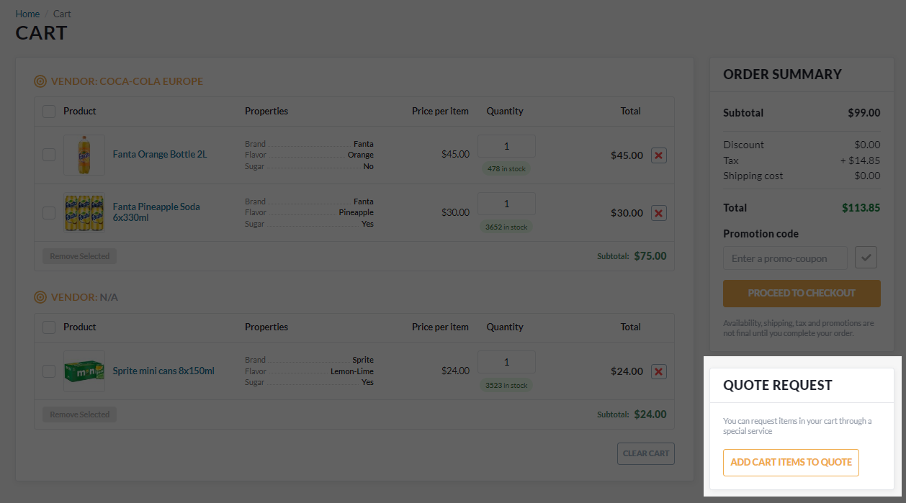

# Submit Quotes

To request personalized pricing (submit a quote):

1. Add the desired products to cart.
1. Click **Cart** in the top menu.
1. In the cart details window, click **Add cart items to quote**. 

    {: width="600"}

1. Your newly created quote request opens. It currently holds the **Draft** status. Here, you can:
    * Add your remarks to the quote, if any.
    * Drag and drop or browse additional files. 

        !!! note
            SCV, DOCX, JPG, PDF, PNG, TXT, XLSX formats are admissible. Each file should not exceed 10MB. Maximum 5 files are allowed. 

    * Review the products list: edit quantities or delete items.
    * Select shipping and billing addresses from the list or create new ones.

1. Click **Submit** to submit the quote to the vendor. The request receives the status **Processing**.

    !!! note
        If you want to submit your quote later, click **Save changes** to save the provided information. The request receives the status **Draft**.

{: width="25"} [Quote requests](../account/quote-requests.md)

 
 
********

    <a href="../lists">← Products lists</a>
    <a href="../notifications">Notifications →</a>

